# Praktikum 1
## Langkah 3
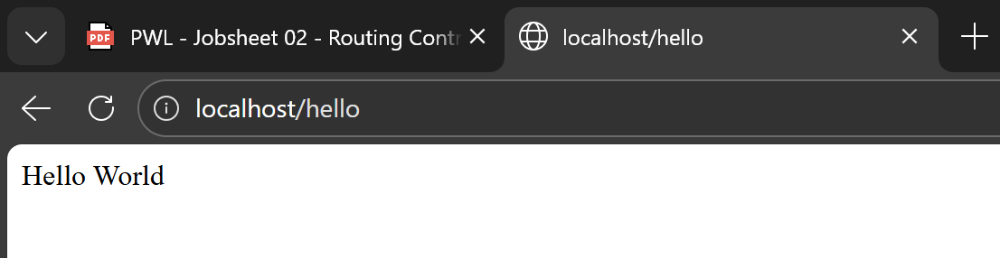
## Langkah 5
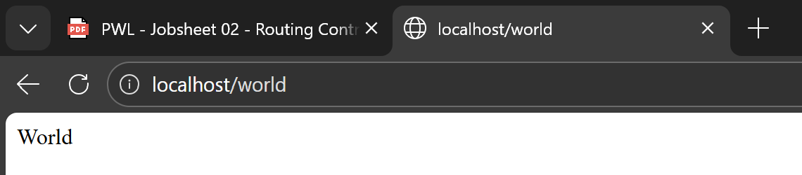
## Langkah 7
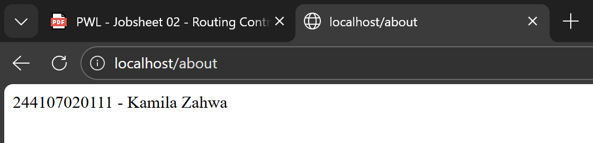
## Langkah 9
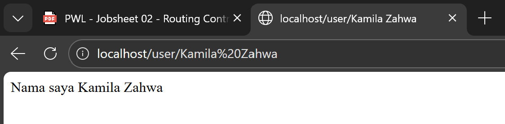
## Langkah 10
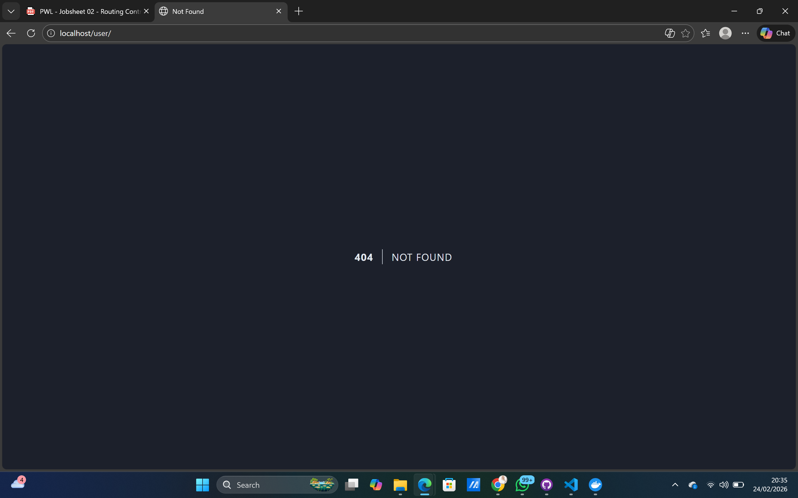
## Langkah 12
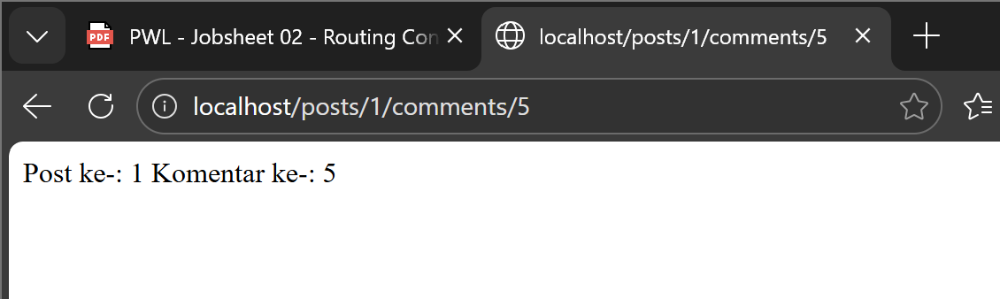
## Langkah 13
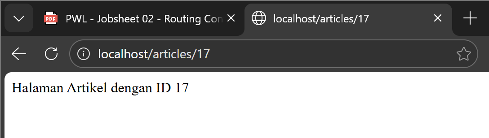
## Langkah 15
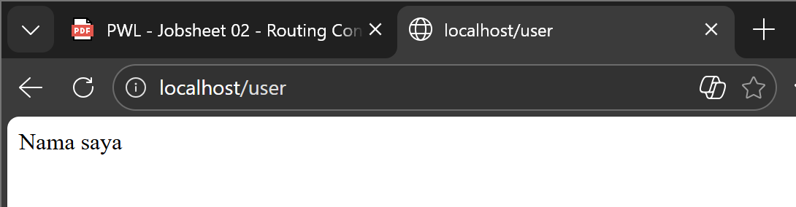
## Langkah 16
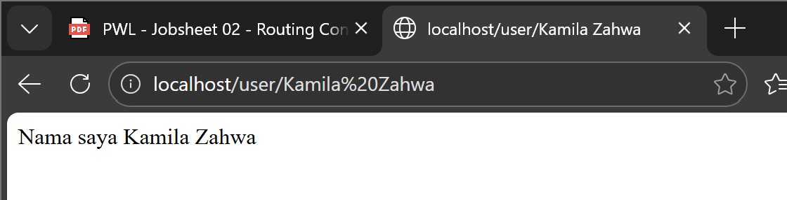
## Langkah 18
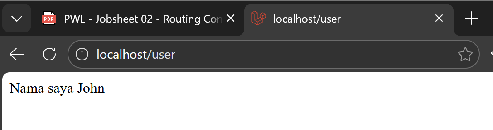
# Praktikum 2
## Langkah 5
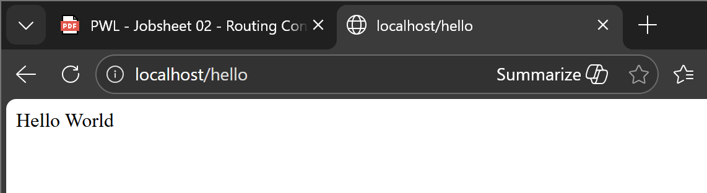
# Praktikum 3
## Langkah 3
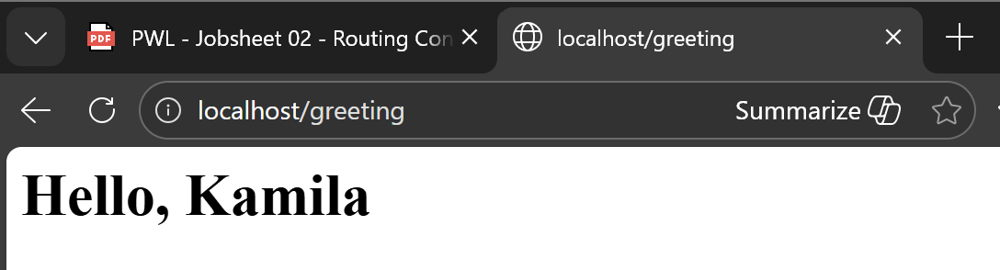
## Langkah 7
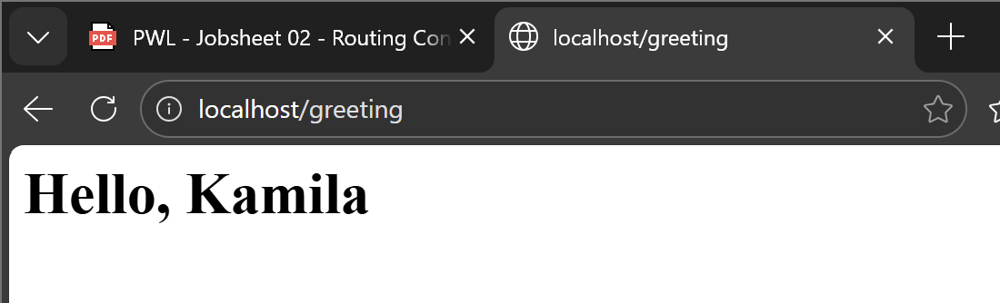
## Langkah 10
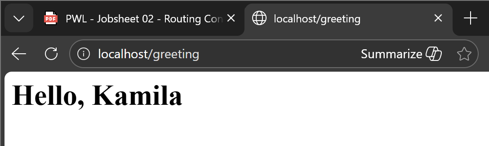
## Langkah 13
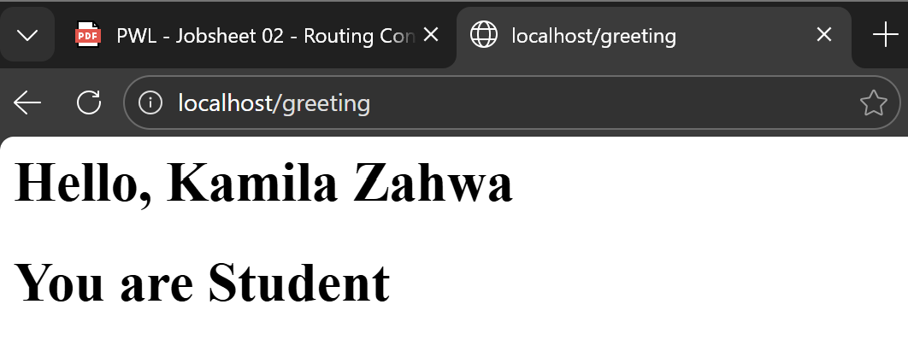
# Soal Praktikum
## Halaman Home
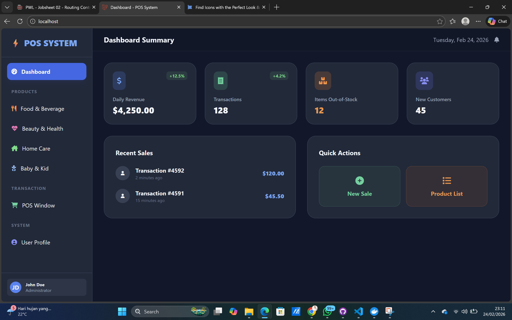
## Halaman Products
### Kategori food and beverage
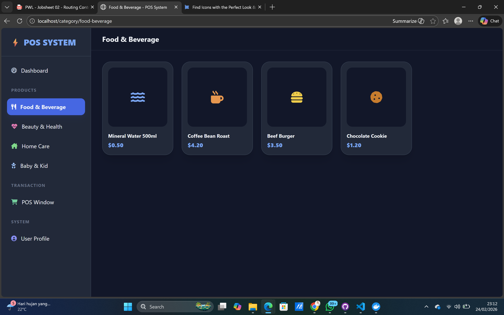
### Kategori beauty and health
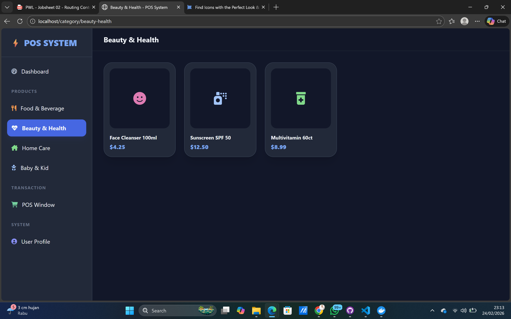
### Kategori home care
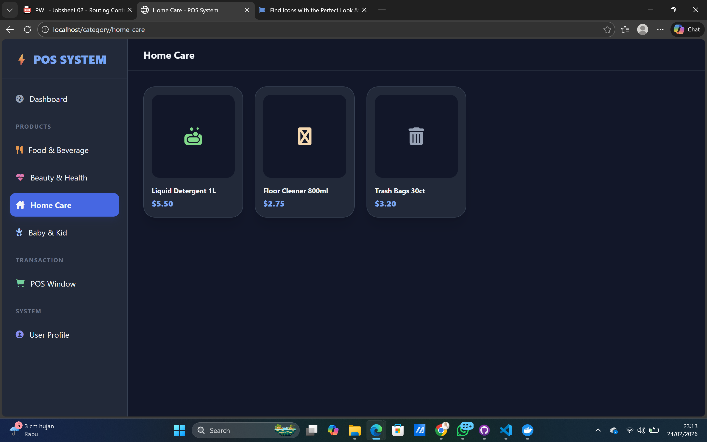
### Kategori babies and kids
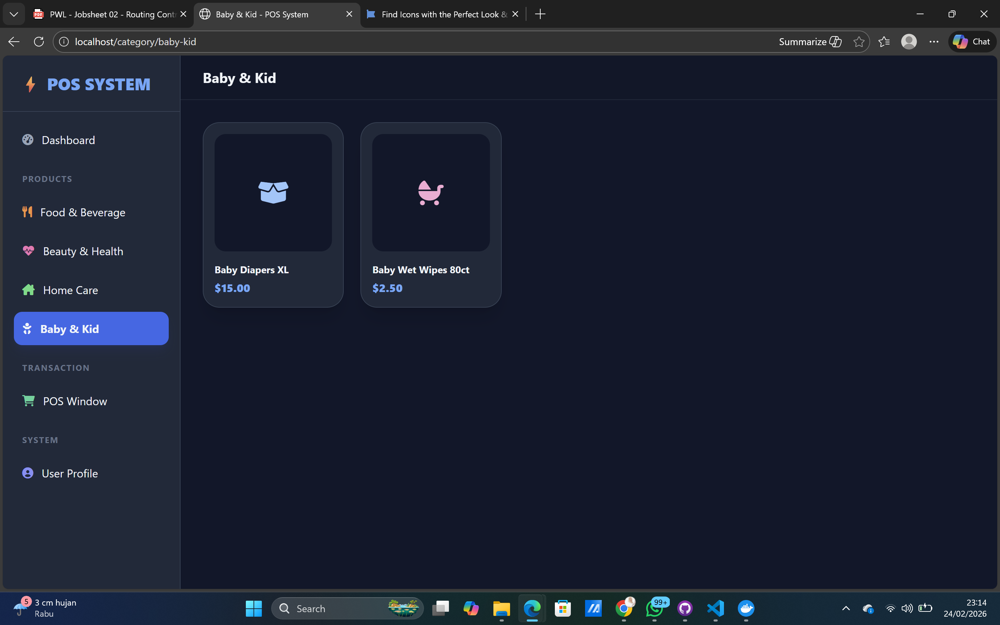
## Halaman User
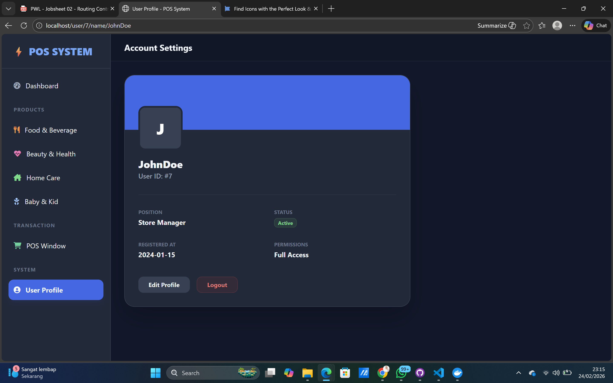
## Halaman Penjualan
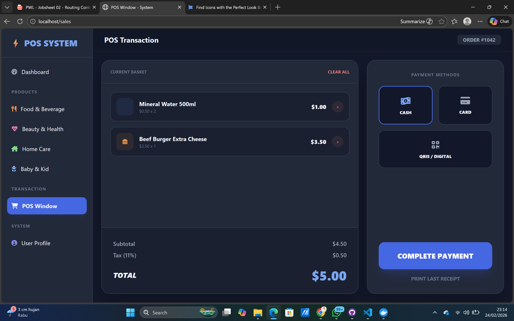