# Laporan Praktikum Week 04 : Model dan Eloquent ORM

## Praktikum 1:  $fillable
### Langkah 3
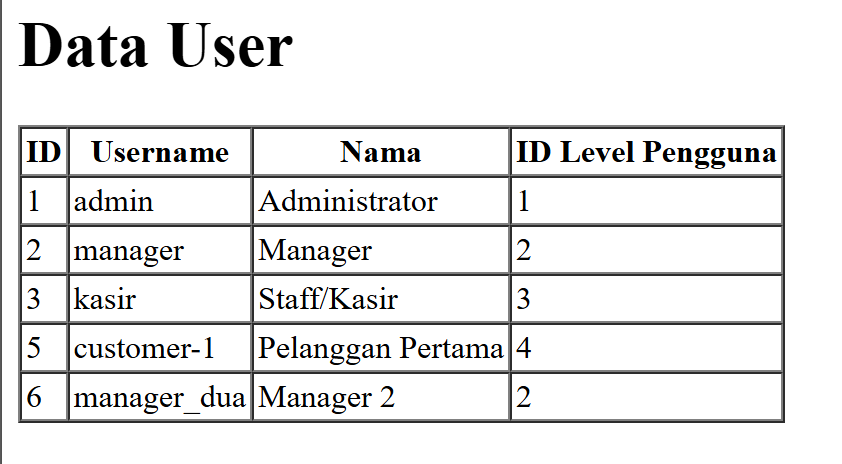
>Data berhasil disimpan ke database karena kita sudah mendaftarkan kolom `level_id`, `username`, `nama`, dan `password` ke dalam properti `$fillable` di UserModel. Properti ini berfungsi seperti "daftar izin" agar kolom-kolom tersebut boleh diisi secara massal.

### Langkah 6
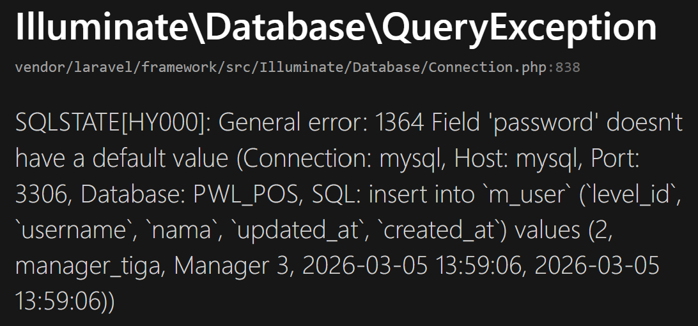
>Jika kita menghapus salah satu kolom dari daftar `$fillable` (misalnya `password`), maka saat kita mencoba menambah data, kolom tersebut akan diabaikan oleh Laravel. Ini adalah fitur keamanan agar user tidak bisa sembarangan mengubah data sensitif yang tidak kita izinkan.

## Praktikum 2.1: Retrieving Single Models
### Langkah 3
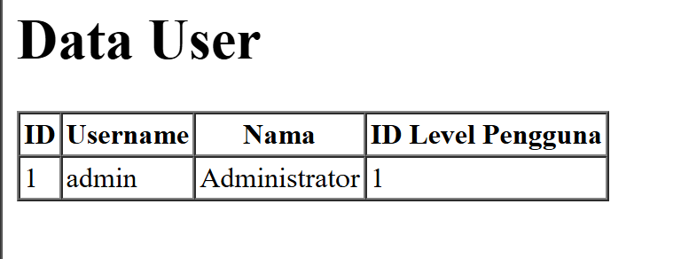
>Browser menampilkan data user dengan ID nomor 1. Fungsi `find(1)` akan mencari data berdasarkan kunci utama (primary key).

### Langkah 5
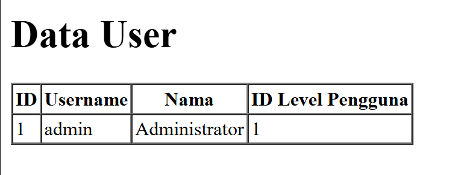
>Hasilnya tetap menampilkan data user pertama yang memiliki `level_id` 1. Metode `where(...)->first()` digunakan untuk mengambil record pertama yang memenuhi kriteria tertentu dari database.

### Langkah 7

>Tampilan tidak berubah, namun kode program menjadi lebih ringkas. Metode `firstWhere()` adalah cara yang lebih singkat dan praktis untuk mendapatkan hasil yang sama dengan langkah sebelumnya.

### Langkah 9
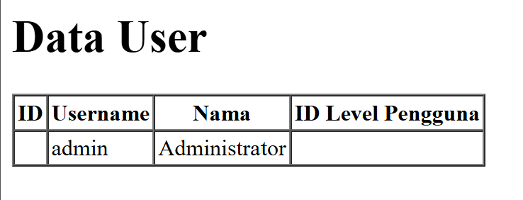
>Data user ID 1 ditampilkan karena data tersebut memang tersedia di dalam database. Metode `findOr()` akan menampilkan data jika ditemukan, namun jika tidak ada, ia akan menjalankan perintah alternatif di dalam fungsi closure.

### Langkah 11
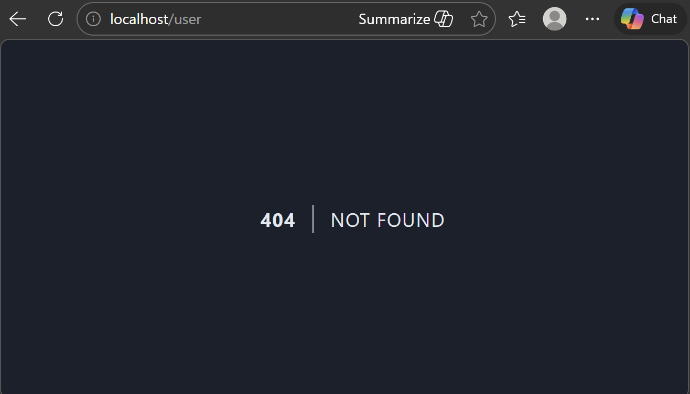
>Browser menampilkan halaman __*Error 404 Not Found*__ karena `user` dengan ID 20 tidak ada.
Karena data tidak ditemukan, fungsi `findOr()` mengeksekusi perintah `abort(404)` sesuai dengan instruksi yang kita berikan.

## Praktikum 2.2: Not Found Exceptions
### Langkah 1
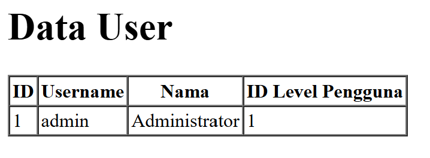
> Data berhasil muncul karena ID yang dicari tersedia. Metode `findOrFail()` akan langsung mengambil data jika ada, namun akan memunculkan error secara otomatis jika data tersebut nihil.

### Langkah 4
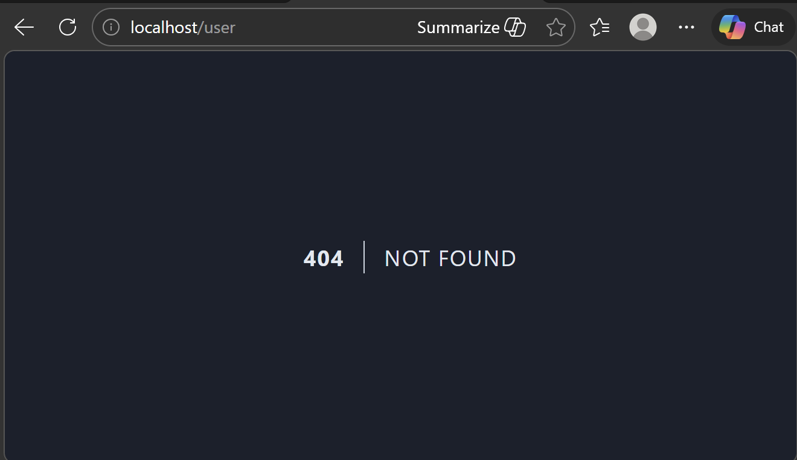
>Muncul halaman error karena `username` 'manager9' tidak ditemukan di database.
Metode `firstOrFail()` akan melempar eksepsi `ModelNotFoundException` yang secara otomatis diterjemahkan Laravel menjadi halaman error 404.

## Praktikum 2.3: Retreiving Aggregrates
### Langkah 2
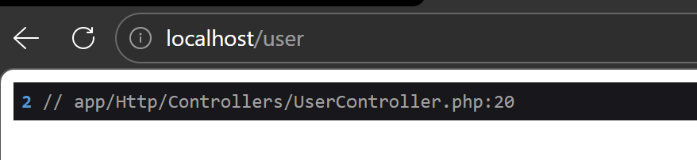
>Muncul angka jumlah total pengguna yang memiliki `level_id` 2 melalui fungsi `dd()`. Eloquent menyediakan metode agregat seperti `count()` untuk menghitung jumlah baris data tanpa perlu mengambil seluruh isinya.

### Langkah 3
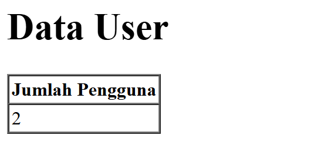
> Halaman web menampilkan teks _"Jumlah Pengguna"_ disertai angka total yang dinamis dari database.
Data hasil perhitungan agregat dari controller dapat dikirimkan dan ditampilkan ke dalam view menggunakan variabel data.

## Praktikum 2.4: Retreiving or Creating Models
### Langkah 3
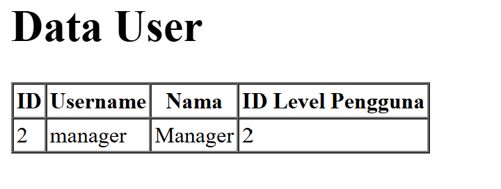
> Data 'manager' berhasil ditampilkan di browser. Metode `firstOrCreate()` akan mengecek keberadaan data. Karena data 'manager' sudah ada dari praktikum sebelumnya, Eloquent hanya mengambil (retrieve) data tersebut tanpa menambah baris baru.

### Langkah 5
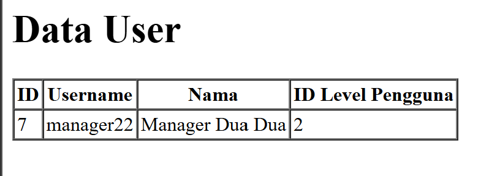
.png)
> Data 'manager22' baru berhasil dibuat dan masuk ke dalam tabel `m_user` di phpMyAdmin. Karena data 'manager22' belum ada di tabel, metode `firstOrCreate()` secara otomatis melakukan operasi insert atau penambahan data baru ke database sesuai dengan nilai yang dimasukkan dalam array.

### Langkah 7
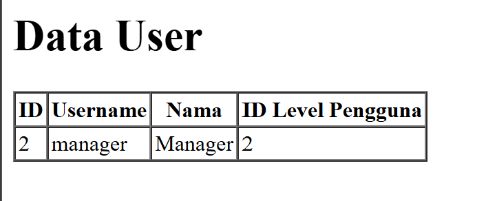
> Tampilan pada browser menunjukkan data `user` 'manager', dan tidak ada penambahan data di phpMyAdmin. Sama seperti `firstOrCreate`, metode `firstOrNew()` akan mencari data terlebih dahulu. Karena data 'manager' ditemukan, model tersebut langsung dikembalikan untuk ditampilkan.

### Langkah 9
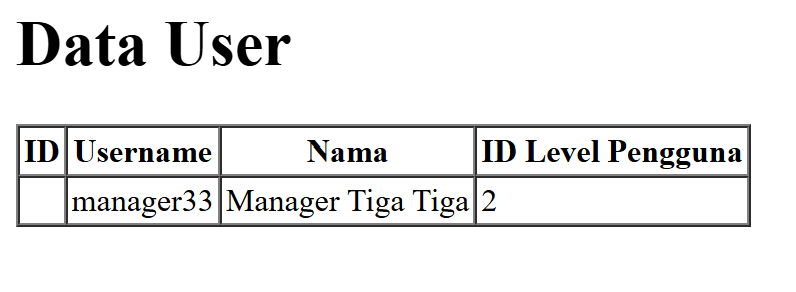
.png)
> Browser menampilkan data 'manager33', tetapi saat tabel `m_user` dicek di phpMyAdmin, data tersebut tidak ditemukan atau tidak tersimpan. `firstOrNew()` hanya menyiapkan objek model baru di memori aplikasi jika data tidak ditemukan. Metode ini tidak langsung menyimpan data ke database secara otomatis.

### Langkah 11
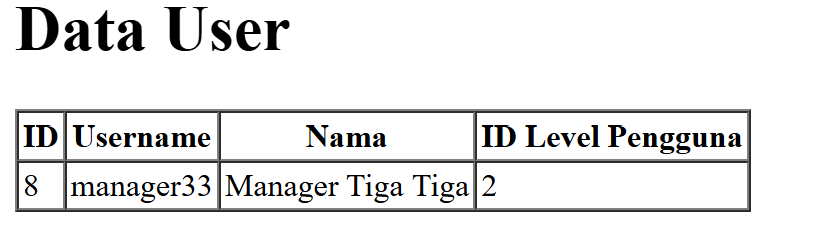
.png)
> Data `user` 'manager33' akhirnya muncul dan tersimpan secara permanen di database phpMyAdmin.
Agar data dari `firstOrNew()` benar-benar tersimpan ke database, kita harus memanggil metode `$user->save()` secara manual setelah objek model dibuat.

## Praktikum 2.5: Attribute Changes
### Langkah 2
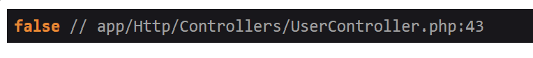
>Fungsi `dd($user->isDirty())` menghasilkan nilai `false`. Hasilnya `false` karena perintah `dd()` dieksekusi setelah perintah `$user->save()` dijalankan. Begitu data sukses disimpan ke database, objek tersebut tidak lagi dianggap "kotor" (dirty) karena isinya sudah sama persis dengan yang ada di database.

### Langkah 4
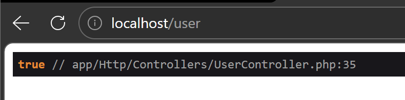
>Fungsi `wasChanged()` menghasilkan nilai `true` setelah perintah `save()` dijalankan. Metode ini memastikan apakah ada atribut yang benar-benar berubah statusnya di database setelah proses penyimpanan selesai.

## Praktikum 2.6: Create, Read, Update, Delete (CRUD)
### Langkah 3
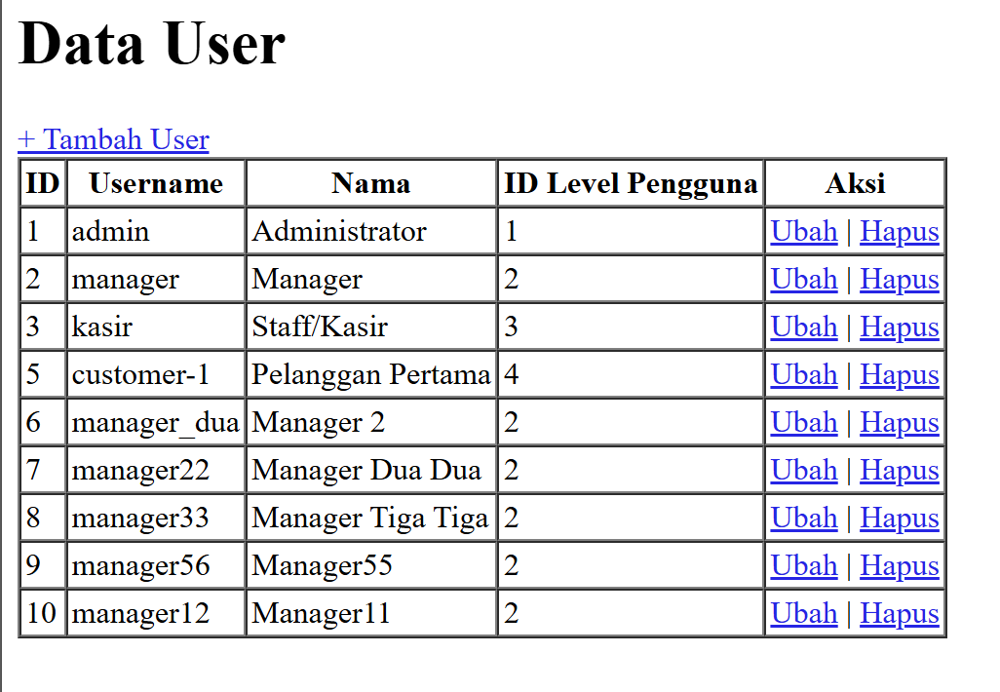    
> Browser berhasil menampilkan tabel yang berisi daftar seluruh pengguna yang ada di database. Kita menggunakan perintah `UserModel::all()` di controller untuk mengambil semua data dari tabel `m_user`, lalu mengirimkannya ke view untuk ditampilkan menggunakan perulangan `@foreach`. 

### Langkah 7
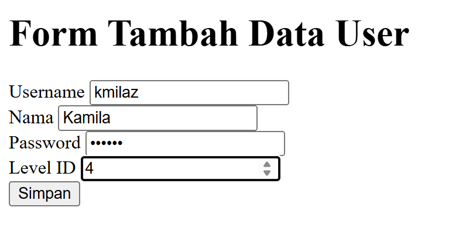
> Browser berhasil menampilkan halaman Form Tambah Data User setelah kita mengklik tombol "+ Tambah User". Namun, pada tahap ini kita belum bisa menambahkan data ke database karena fungsi untuk menyimpannya belum dibuat.

### Langkah 10
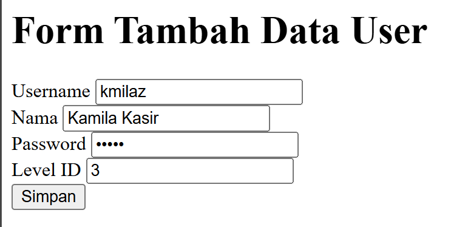    
.png)
>User baru berhasil masuk ke database dan langsung tampil pada daftar tabel `user` di halaman utama.
Method `tambah_simpan()` menangkap inputan dari form melalui objek `Request`, lalu menyimpannya ke database menggunakan perintah `UserModel::create()`.

### Langkah 14
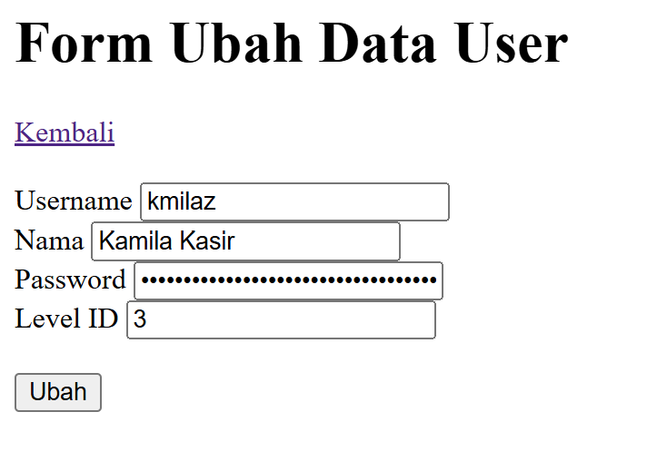
> Halaman beralih ke form ubah di mana semua kolom input sudah terisi otomatis dengan data lama milik user tersebut. Method `ubah()` bertugas mencari data user berdasarkan ID yang diklik menggunakan fungsi `find($id)`, kemudian mengirimkan objek data tersebut ke view agar bisa dijadikan nilai awal pada inputan.

### Langkah 17
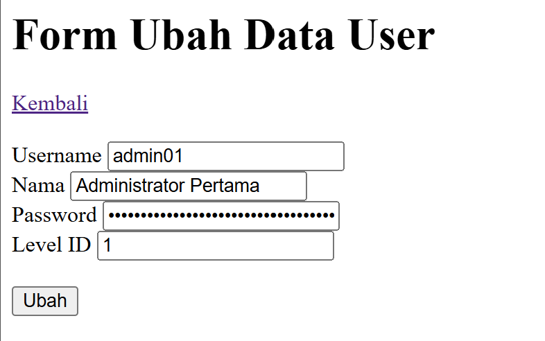    
.png)
>Data user berubah sesuai inputan terbaru. Proses pembaruan ini menggunakan method PUT yang divalidasi melalui `method_field('PUT')`. Di sisi controller, kita mencari data lama dengan `find()`, menimpa atributnya, lalu menyimpannya kembali dengan `save()`.

### Langkah 20
#### Sebelum
.png)
#### Sesudah
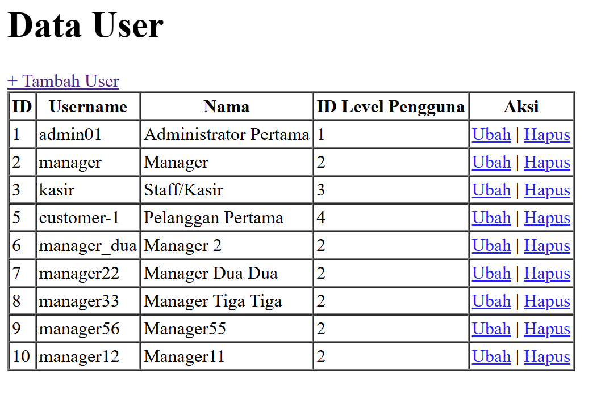
> Baris data user yang dipilih langsung menghilang dari tabel dan tidak lagi ditemukan di database. Method `hapus()` mencari record data berdasarkan ID yang dikirimkan, lalu mengeksekusi fungsi `delete()` pada model tersebut untuk menghapusnya secara permanen.

## Praktikum 2.7: Relationships
### Langkah 3
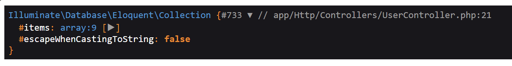
>Fungsi `dd()` menunjukkan bahwa data `user` sekarang membawa data dari tabel `m_level` di dalamnya.

### Langkah 6
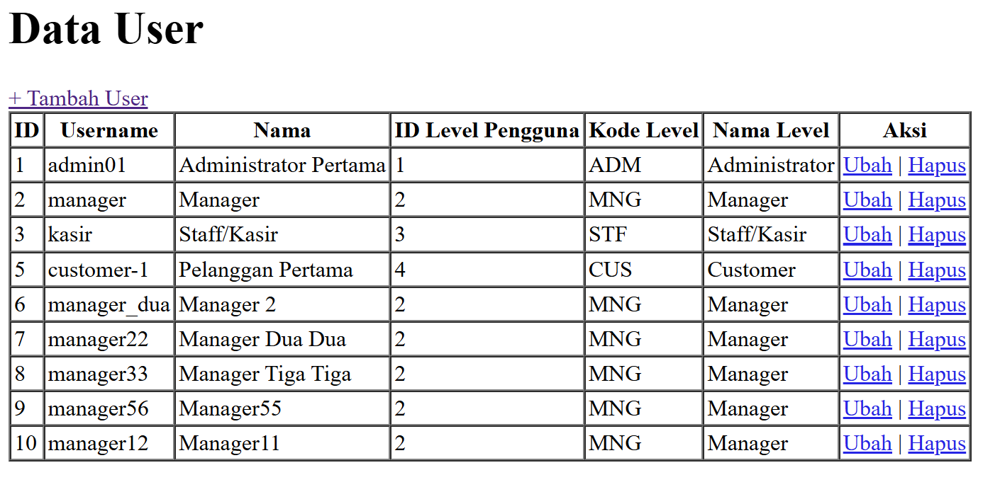
>Tabel `user` menampilkan kolom Kode Level dan Nama Level. Dengan mendefinisikan relasi `belongsTo` di model dan menggunakan `with('level')` di controller, kita bisa mengambil data dari tabel `m_level` yang terhubung dengan tabel `user`.