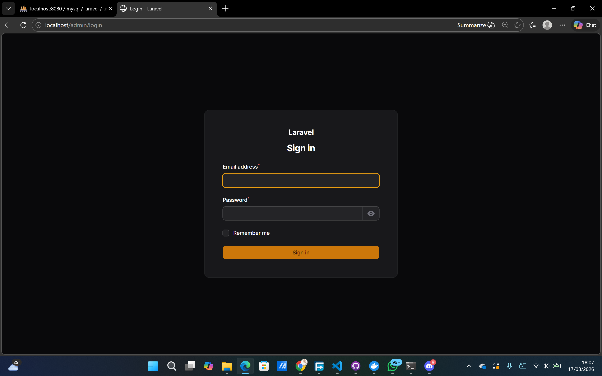
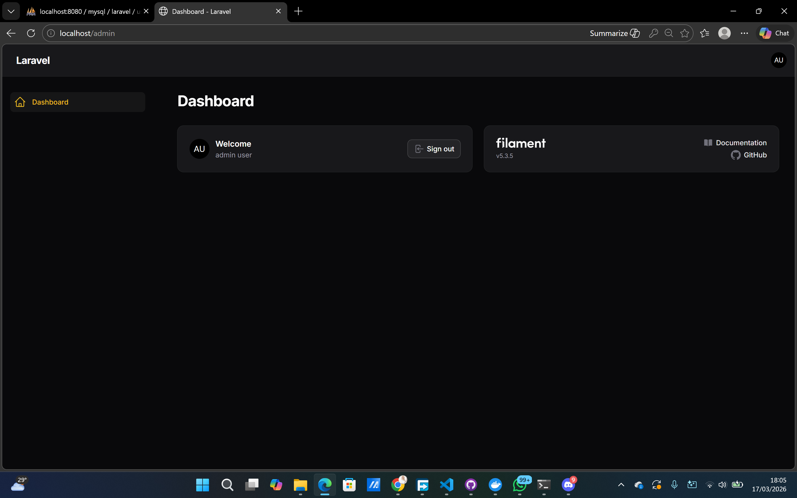

# Hasil Praktikum Jobsheet 01

## Halaman Login

## Halaman Dashboard

## Analisis dan Diskusi

1. Apa kelebihan Filament dibanding membuat admin panel manual?
> Dengan Filament, proses development menjadi jauh lebih cepat karena fitur CRUD bisa langsung digunakan tanpa harus menulis banyak kode dari awal. Selain itu, tampilannya juga sudah rapi dan modern sehingga tidak perlu mendesain UI sendiri. Filament juga sudah terintegrasi dengan Laravel, sehingga lebih mudah digunakan bagi developer yang sudah familiar. Ditambah lagi, banyak fitur bawaan seperti form, tabel, filter, dan validasi yang membuat kode lebih terstruktur dan mudah di-maintain.
2. Mengapa Filament menggunakan Livewire?
> Filament memanfaatkan Laravel Livewire untuk menciptakan aplikasi yang tetap interaktif tanpa bergantung banyak pada JavaScript. Dengan Livewire, developer bisa fokus menggunakan PHP namun tetap mampu menghasilkan tampilan yang dinamis dan dapat diperbarui secara langsung tanpa perlu reload halaman.
3. Apa perbedaan SQLite dan MySQL dalam development?
> Perbedaan antara SQLite dan MySQL dalam development terletak pada skala dan cara penggunaannya. SQLite merupakan database berbasis file yang sangat sederhana, tidak memerlukan server, dan cocok digunakan untuk development atau testing karena setup-nya cepat dan ringan. Sedangkan MySQL adalah database yang menggunakan server, lebih cocok untuk aplikasi skala besar atau production, serta mampu menangani banyak pengguna dan query yang lebih kompleks.
4. Apa fungsi Panel Builder?
> Panel Builder pada Filament digunakan sebagai alat untuk menyusun dan mengelola tampilan serta struktur aplikasi dengan lebih mudah. Melalui fitur ini, developer dapat mengatur berbagai bagian seperti halaman, menu navigasi, serta data yang ingin ditampilkan dalam sistem. Selain itu, Panel Builder juga membantu dalam mengatur hak akses pengguna dan konfigurasi tampilan sesuai kebutuhan. Dengan begitu, proses pengembangan menjadi lebih praktis, terstruktur, dan mudah untuk dikembangkan kembali.
