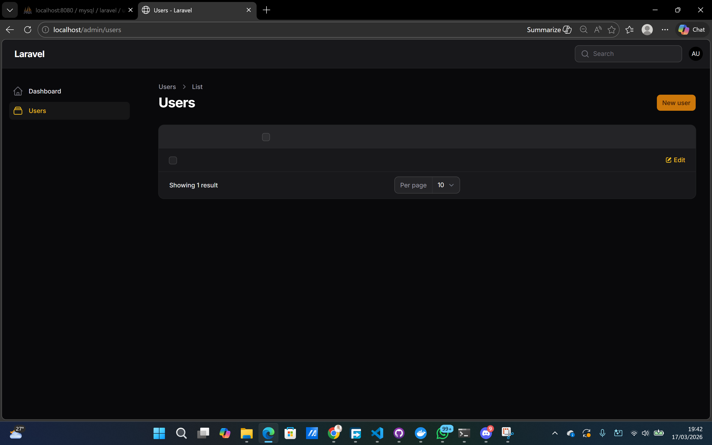
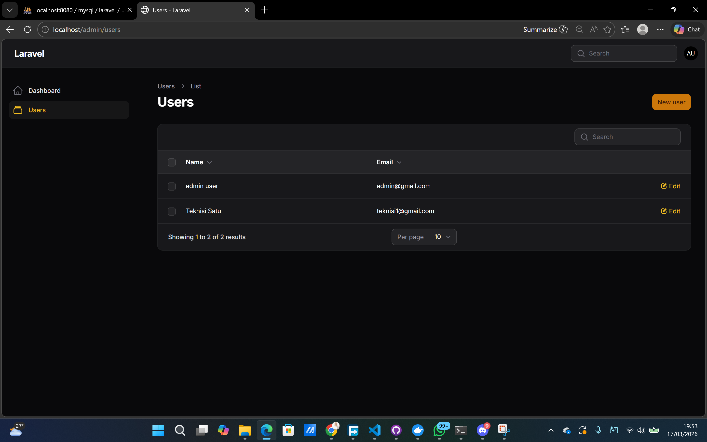
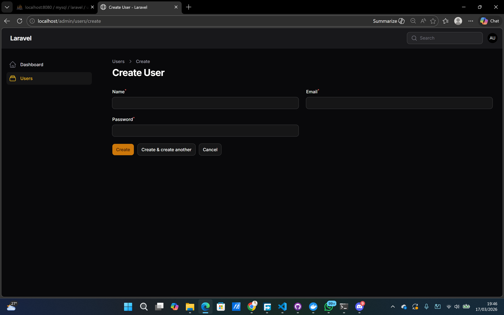
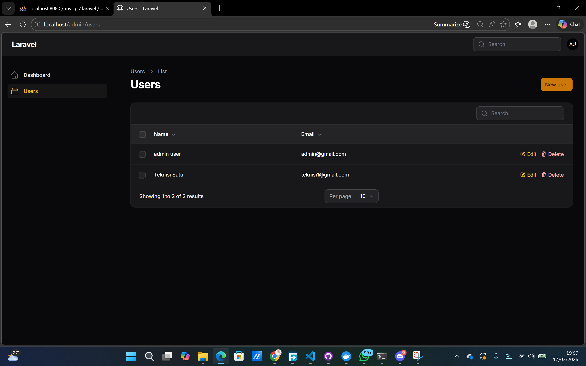
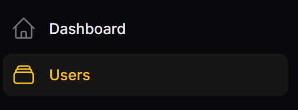
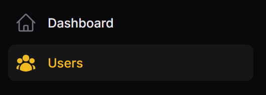

# Hasil Praktikum Jobsheet 02

## Halaman Resource User

## Halaman Kolom

## Halaman Create untuk User

## Hasil Menambahkan Tombol Delete

## Hasil Mengganti Icon untuk User
Sebelum:

Sesudah:

## Analisis dan Diskusi
1. Mengapa Filament dapat membuat CRUD tanpa banyak coding?
> Filament sudah menyediakan komponen dan struktur bawaan yang siap digunakan. Kita hanya perlu mendefinisikan model dan sedikit konfigurasi, lalu Filament akan secara otomatis menghasilkan form, tabel, serta proses Create, Read, Update, dan Delete. Hal ini dimungkinkan karena Filament dibangun di atas Laravel yang memiliki sistem ORM (Eloquent), sehingga pengolahan data menjadi lebih sederhana dan tidak perlu ditulis secara manual dari awal.

2. Apa perbedaan Form Schema dan Table Schema?
> Perbedaan antara Form Schema dan Table Schema terletak pada fungsinya dalam menampilkan data. Form Schema digunakan untuk mengatur tampilan dan struktur form saat input atau edit data, seperti field, label, dan validasi. Sedangkan Table Schema digunakan untuk menampilkan data dalam bentuk tabel, seperti kolom, sorting, dan filter.

3. Bagaimana jika kita ingin menambahkan validasi email unik?
> Jika ingin menambahkan validasi email unik, kita bisa menggunakan aturan validasi dari Laravel, yaitu dengan menambahkan rule `unique` pada field email. Dengan begitu, sistem akan otomatis mengecek apakah email yang dimasukkan sudah ada di database atau belum. Jika sudah digunakan, maka akan muncul pesan error sehingga data tidak bisa disimpan. Hal ini membantu menjaga agar data tetap konsisten dan tidak terjadi duplikasi.

4. Mengapa password tidak perlu kita hash manual?
> Password tidak perlu kita hash secara manual karena Laravel sudah menyediakan fitur otomatis untuk melakukan hashing, biasanya melalui model atau mutator. Saat password disimpan, sistem akan langsung mengenkripsinya menggunakan algoritma yang aman seperti `bcrypt`. Dengan begitu, developer tidak perlu menangani proses hashing secara langsung, sekaligus memastikan keamanan data pengguna tetap terjaga.