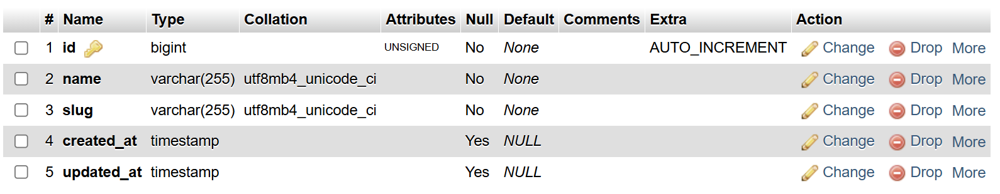
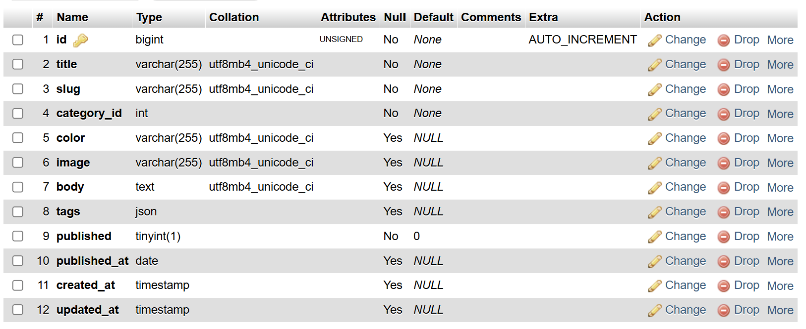
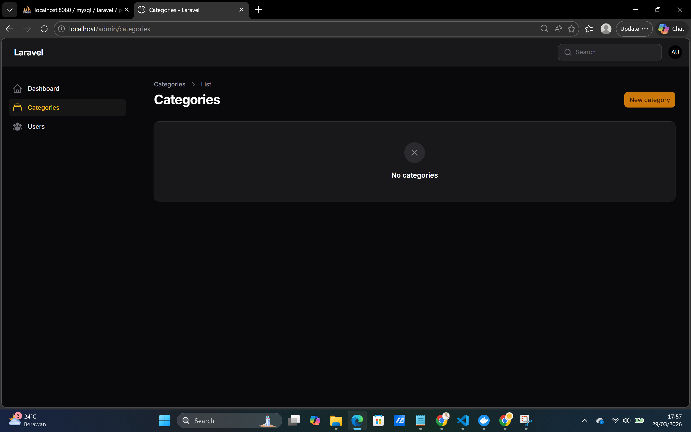
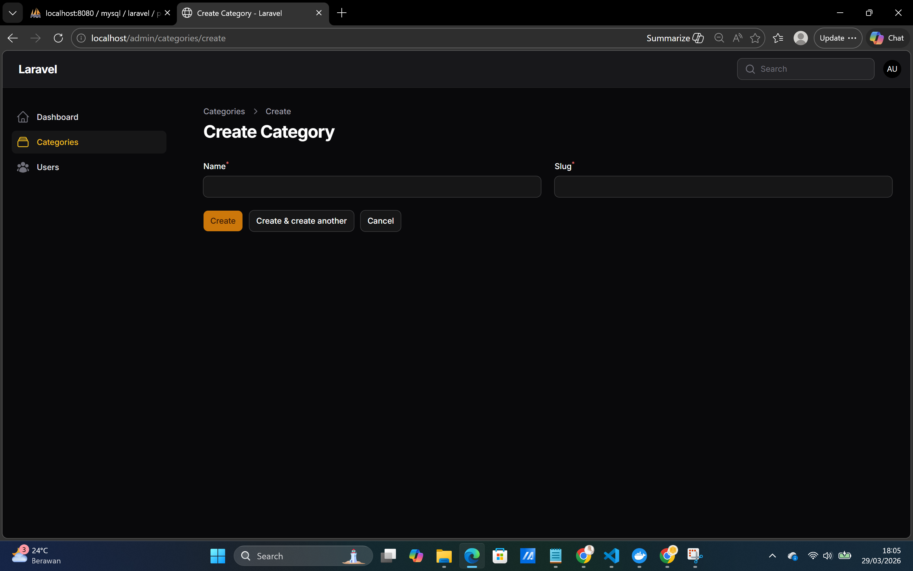
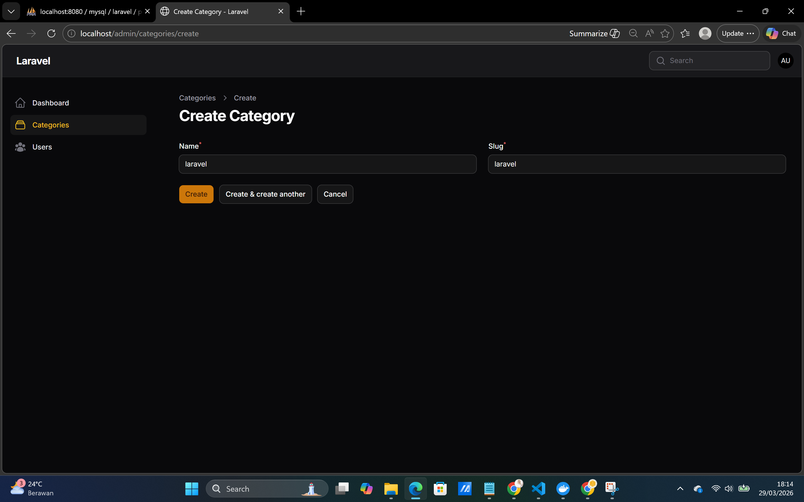
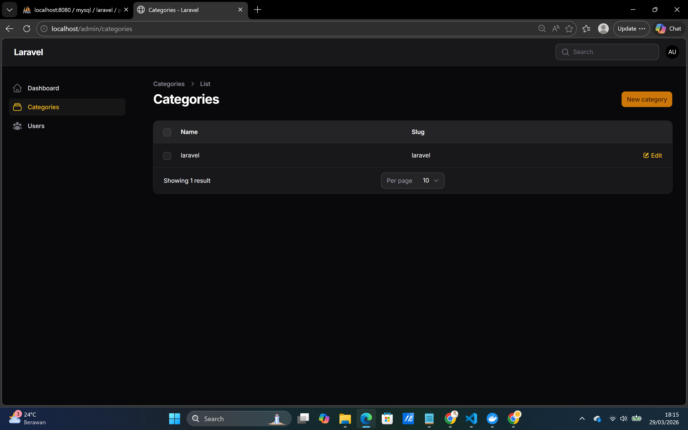

# Hasil Praktikum Jobsheet 03

## Tabel Category

## Tabel Post

## Halaman Category

## Halaman Form Category

## Halaman Kolom Category

## Analisis dan Diskusi
1. Mengapa kita perlu `$fillable`?
> Kita perlu `$fillable` di Laravel untuk menentukan field mana saja yang boleh diisi secara mass assignment. Dengan adanya `$fillable`, kita bisa membatasi data yang dapat dimasukkan ke dalam model, sehingga mencegah user mengirimkan field yang tidak seharusnya diubah.

2. Apa fungsi `$casts` pada Laravel?
> Fungsi `$casts` pada Laravel adalah untuk mengatur tipe data atribut pada model agar otomatis dikonversi sesuai dengan tipe yang diinginkan. Misalnya, data yang disimpan sebagai string di database bisa diubah menjadi boolean, array, atau datetime saat diakses di aplikasi.

3. Apa perbedaan integer biasa dengan foreign key?
> Perbedaan antara integer biasa dengan foreign key terletak pada fungsinya. Integer biasa hanya menyimpan angka tanpa keterkaitan dengan data lain, sedangkan foreign key digunakan untuk menghubungkan satu tabel dengan tabel lainnya. Foreign key juga memiliki constraint yang memastikan nilai yang disimpan harus sesuai dengan data yang ada di tabel referensi, sehingga menjaga integritas relasi antar data.

4. Bagaimana jika category dihapus tetapi masih ada post?
> Jika category dihapus tetapi masih ada post yang menggunakan category tersebut, maka akan menimbulkan masalah pada data relasi. Dalam konteks jobsheet ini, karena `category_id` masih berupa integer biasa dan belum dijadikan foreign key, maka data post tetap akan ada meskipun category-nya sudah dihapus. Namun, nilai `category_id` pada post tersebut akan mengarah ke data yang sudah tidak ada, sehingga relasinya menjadi tidak valid (broken relation). Hal ini bisa menyebabkan error atau data tidak bisa ditampilkan dengan benar saat relasi dipanggil di aplikasi.