# Hasil Praktikum Jobsheet 01

## Membuat Resource Post
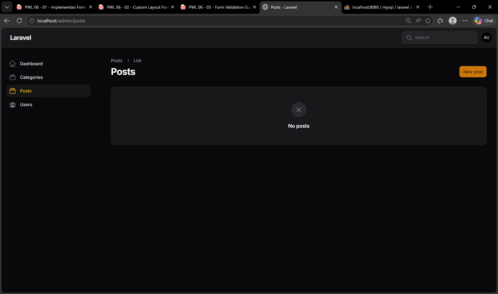
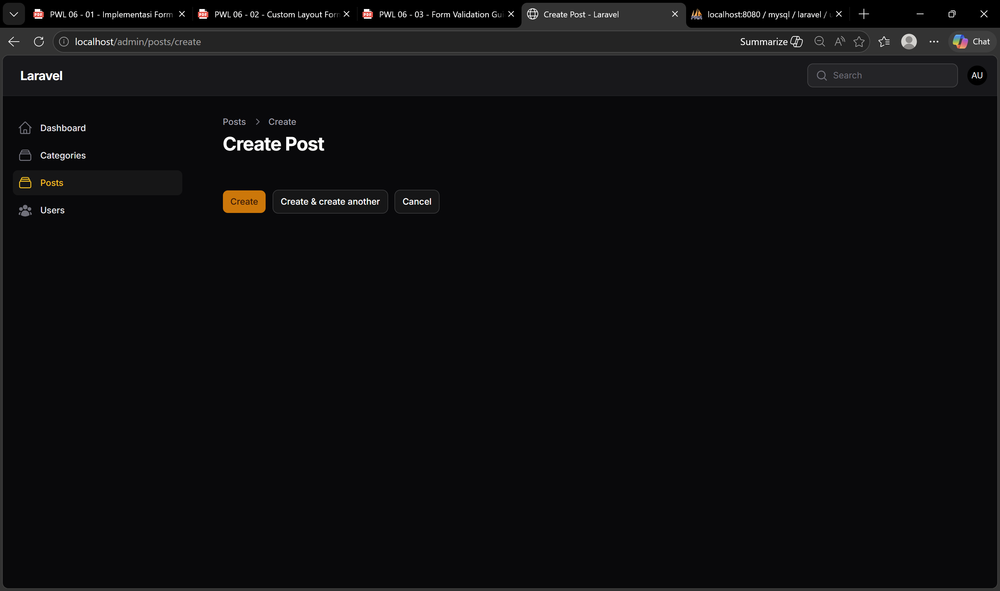

## Implementasi Form Elements
#### Text Input
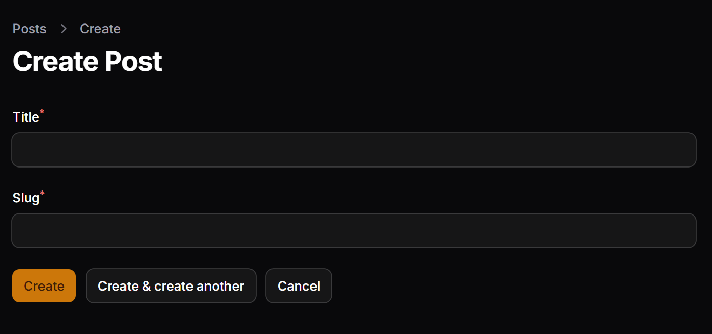
#### Select
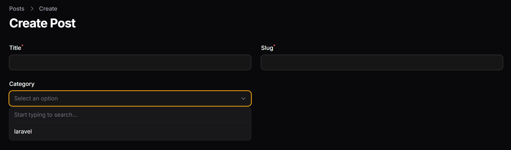
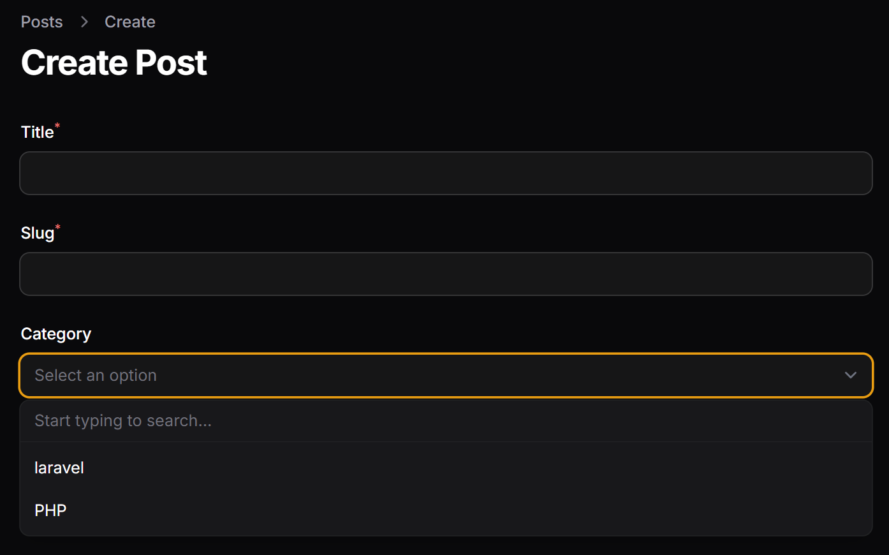
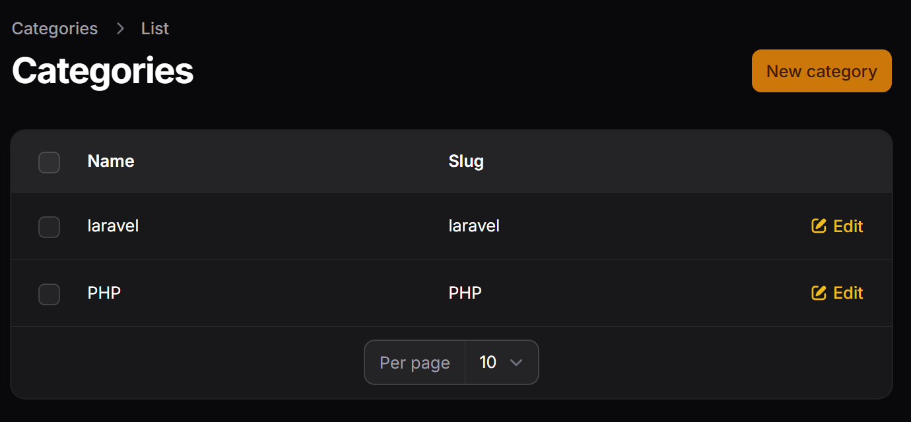
#### Color Picker
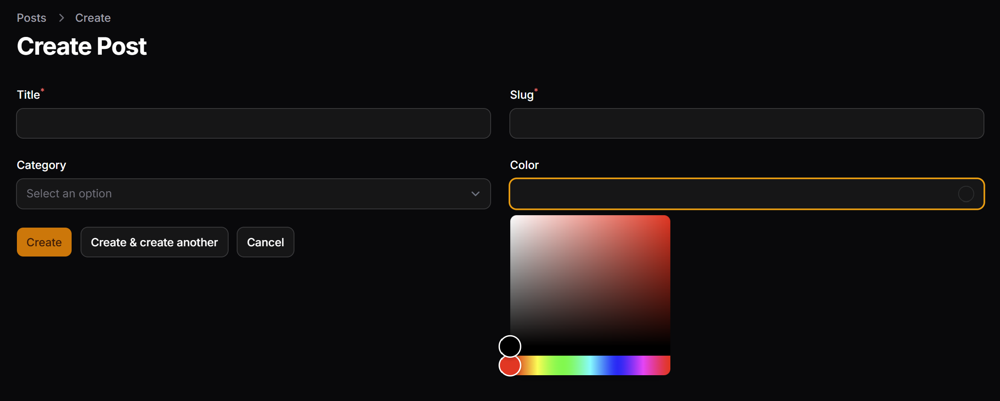
#### Markdown/Rich Editor
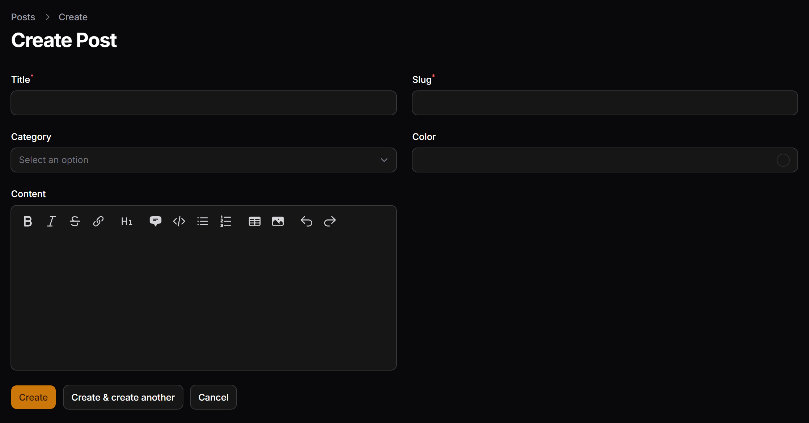
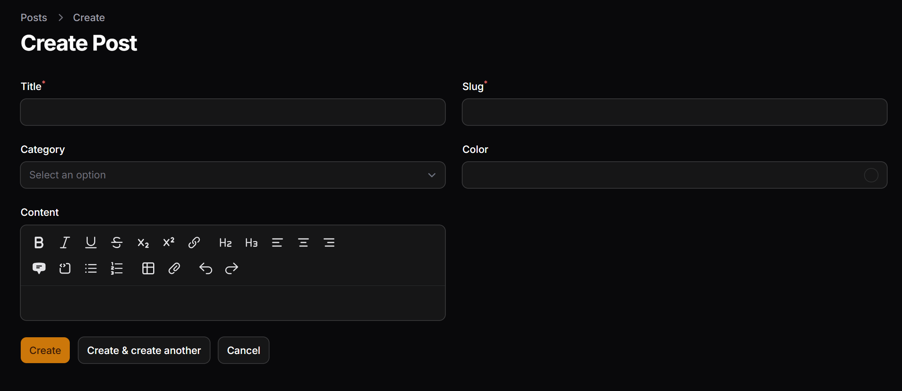
#### File Upload
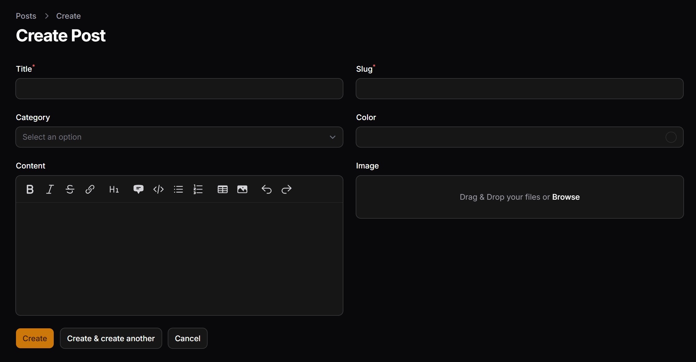
#### Tags Input
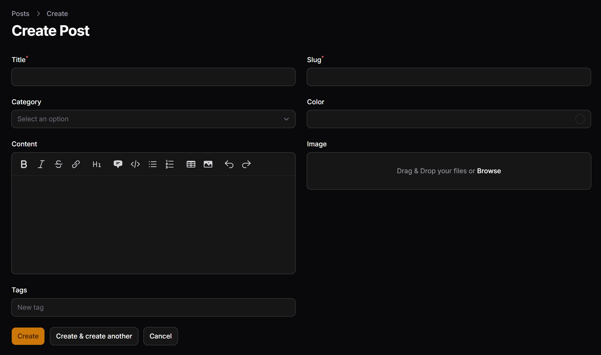
#### Checkbox
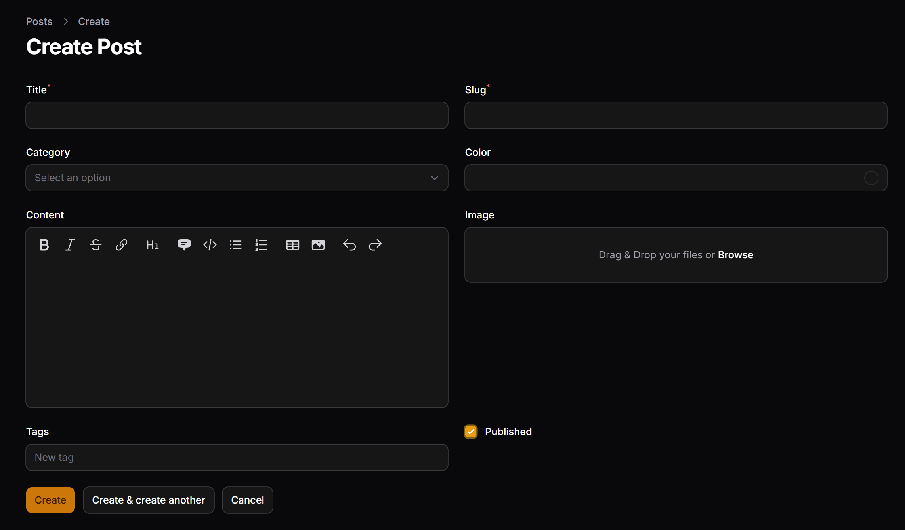
#### Date Picker
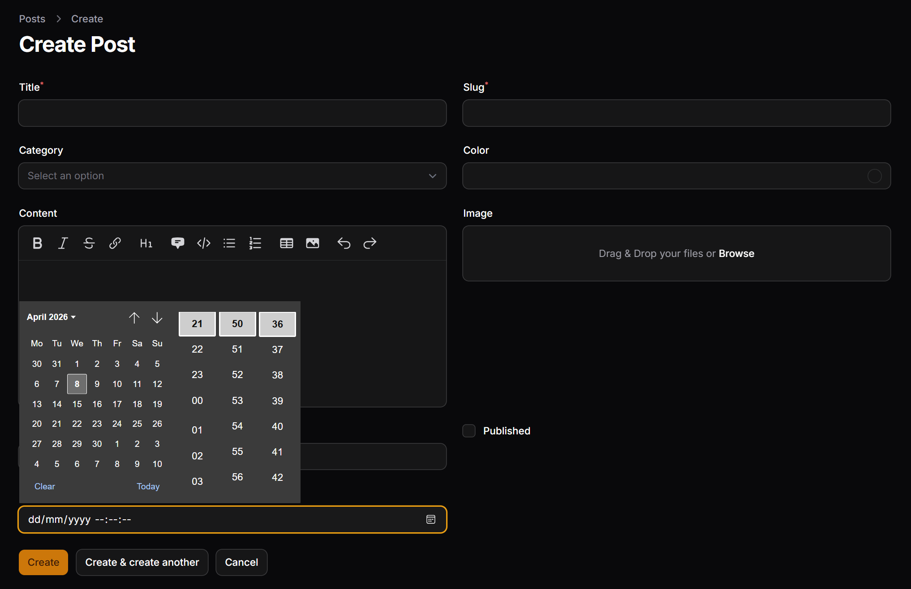

## Menampilkan Data di Tabel
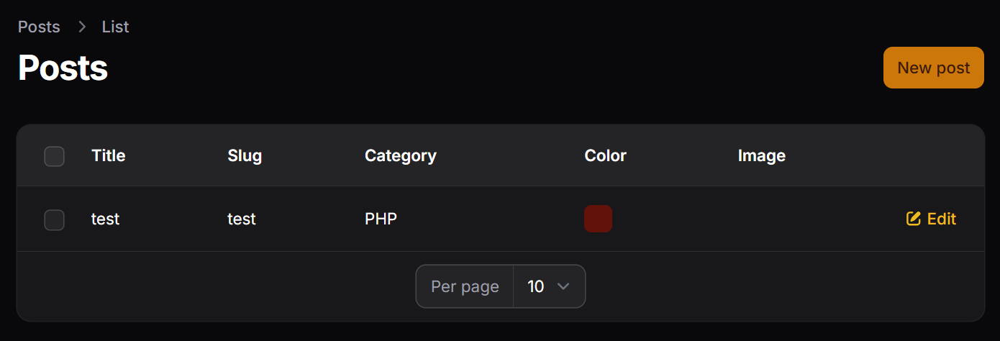
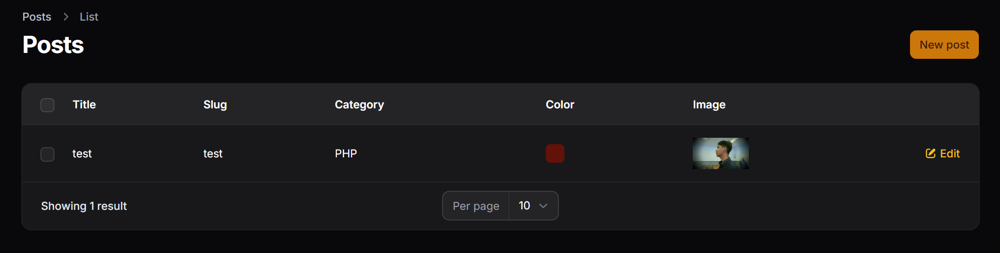

## Pengujian
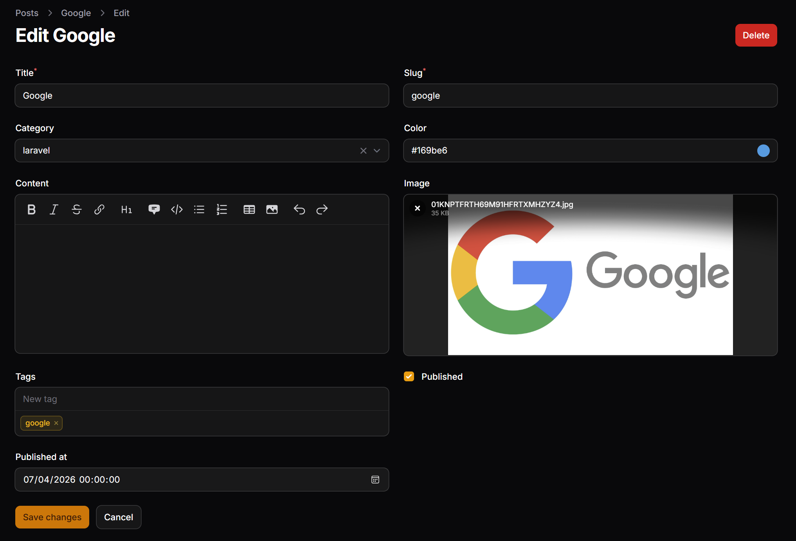
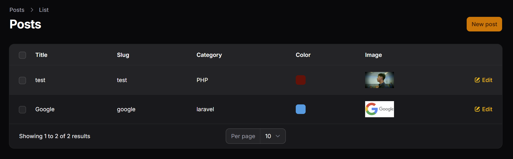

## Analisis dan Diskusi

1. Mengapa kita perlu storage:link?
> Menggunakan perintah storage:link sangat penting karena file yang di-upload melalui aplikasi Laravel, seperti gambar, disimpan di dalam folder storage yang secara default tidak dapat diakses langsung oleh browser. Dengan menjalankan perintah tersebut, sistem akan membuat symbolic link yang menghubungkan folder storage/app/public ke public/storage, sehingga file yang disimpan dapat ditampilkan di halaman web. Tanpa langkah ini, meskipun file berhasil di-upload, file tersebut tidak akan bisa diakses atau ditampilkan oleh pengguna.

2. Apa fungsi $casts untuk field JSON?
> Fungsi `$casts` untuk field JSON adalah untuk mengubah format data dari JSON menjadi array atau tipe data lain yang lebih mudah digunakan di dalam aplikasi. Secara default, data JSON yang diambil dari database akan berbentuk string, sehingga akan sulit untuk diproses. Dengan menggunakan `$casts`, Laravel secara otomatis mengonversi data tersebut menjadi array saat diambil, dan mengubahnya kembali menjadi JSON saat disimpan ke database, sehingga mempermudah pengolahan data di sisi aplikasi.

3. Mengapa kita menggunakan `category.name` bukan `category_id`? 
> Penggunaan `category.name` dibandingkan `category_id` bertujuan untuk menampilkan data yang lebih informatif dan mudah dipahami oleh pengguna. Nilai `category_id` hanya berupa angka yang merepresentasikan relasi ke tabel kategori, sehingga tidak memberikan informasi yang jelas. Sebaliknya, `category.name` mengambil data nama kategori melalui relasi yang telah dibuat, sehingga tampilan di tabel menjadi lebih user-friendly dan mudah dibaca.

4. Apa perbedaan RichEditor dan MarkdownEditor?
> Perbedaan antara RichEditor dan MarkdownEditor terletak pada cara penggunaannya. RichEditor merupakan editor berbasis visual (WYSIWYG) yang memungkinkan pengguna langsung melihat hasil format teks seperti pada aplikasi pengolah kata, sehingga lebih mudah digunakan oleh pengguna umum. Sementara itu, MarkdownEditor menggunakan sintaks markdown seperti tanda bintang atau pagar untuk mengatur format teks, sehingga lebih ringan dan biasanya digunakan oleh pengguna yang terbiasa dengan penulisan berbasis teks.