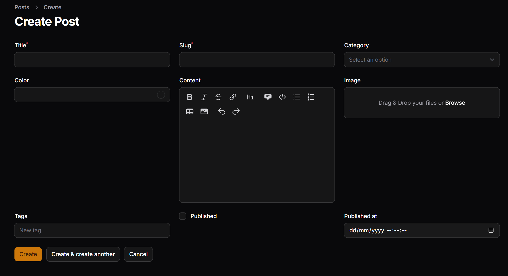
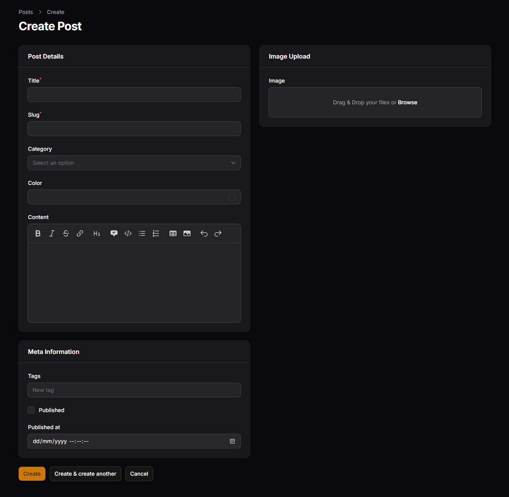
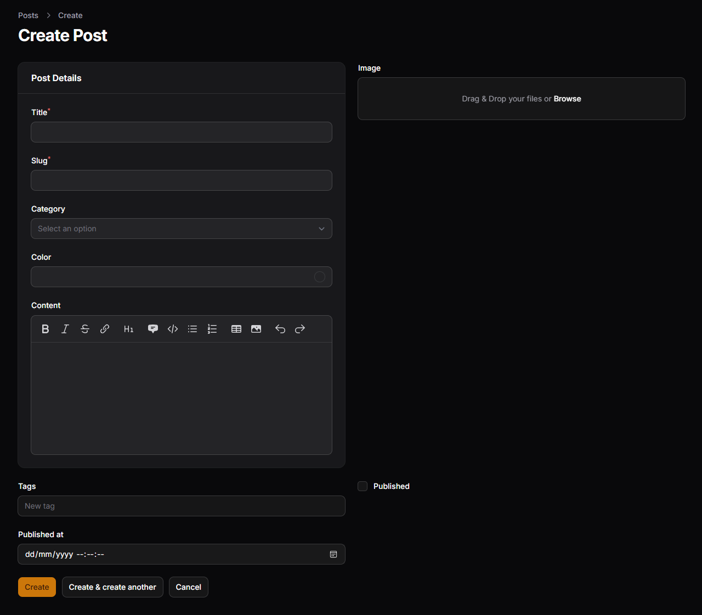
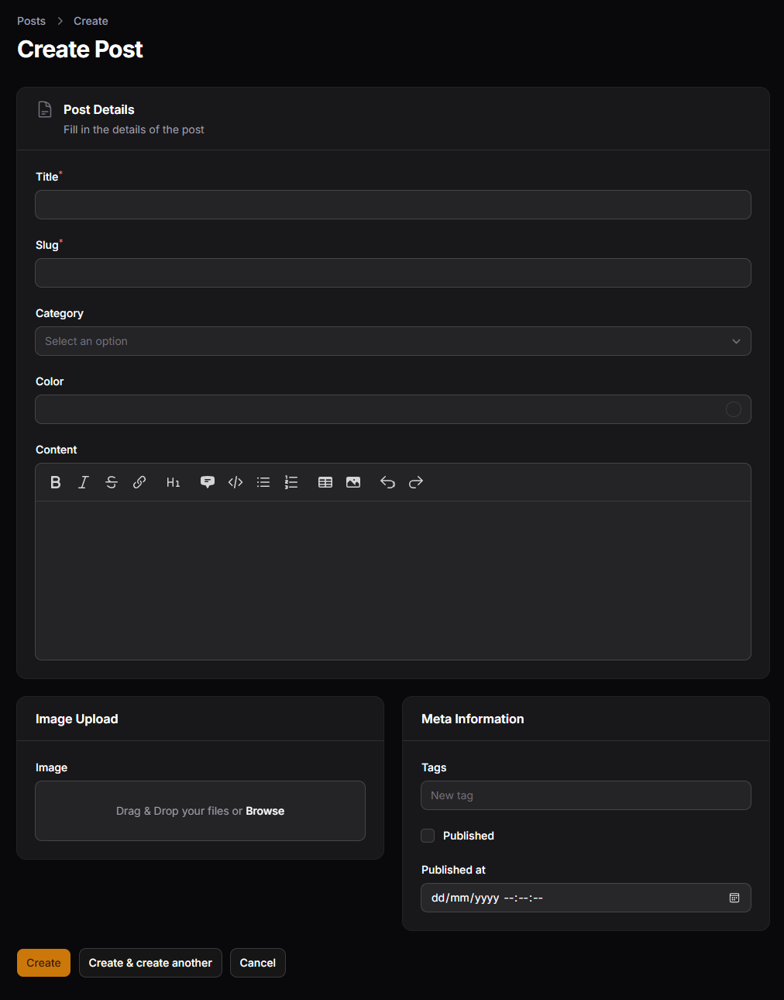
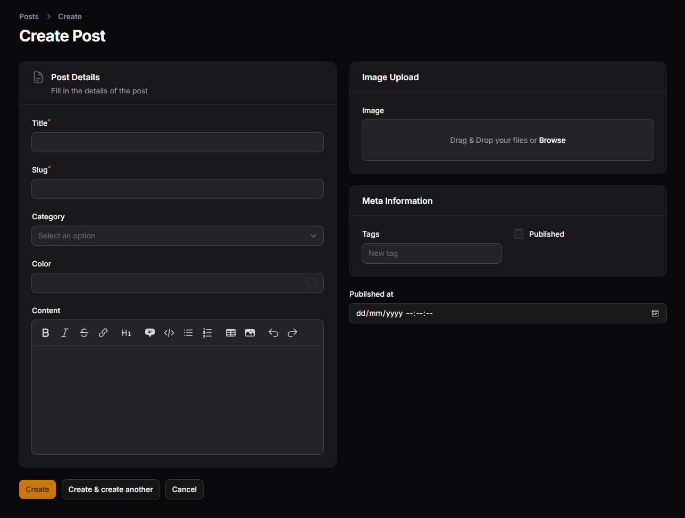
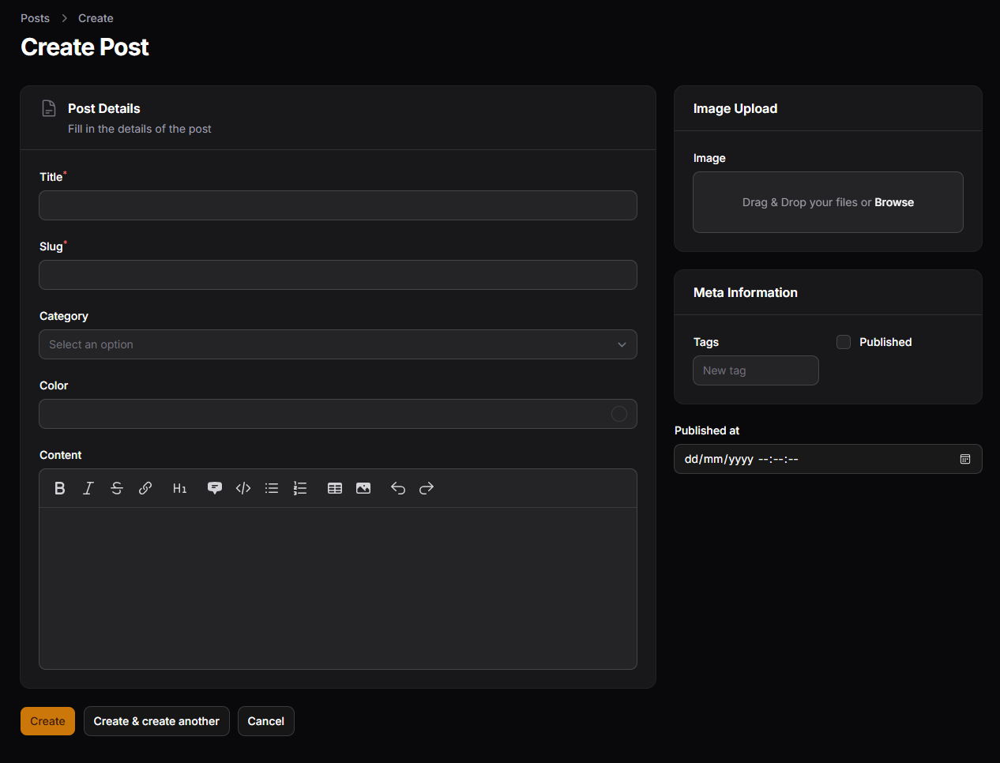

# Hasil Praktikum Jobsheet 02

## Mengatur Layout Dasar dengan Columns

## Menggunakan Section

## Membuat Section Terpisah

## Menggunakan Group untuk Layout Horizontal

## Analisis dan Diskusi
1. Mengapa layout form penting dalam aplikasi admin?
> Layout form dalam aplikasi admin sangat penting karena berpengaruh pada kenyamanan dan kemudahan pengguna dalam menginput data. Dengan layout yang terstruktur, form menjadi lebih rapi, mudah dipahami, dan terlihat lebih profesional. Tanpa pengaturan layout yang baik, form dapat terlihat berantakan sehingga menyulitkan pengguna dalam mengisi data dengan benar.

2. Apa perbedaan Section dan Group?
> Perbedaan antara Section dan Group terletak pada fungsi dan tampilannya. Section digunakan untuk mengelompokkan field dengan tampilan visual seperti kotak, judul, dan ikon, sehingga membantu dalam pengorganisasian form secara visual. Sementara itu, Group tidak memiliki tampilan visual dan hanya digunakan untuk mengatur tata letak atau struktur field dalam form, seperti pengaturan kolom atau posisi elemen.

3. Kapan kita menggunakan `columnSpanFull()`?
> Penggunaan `columnSpanFull()` diperlukan ketika suatu field ingin ditampilkan dengan lebar penuh tanpa mengikuti pembagian kolom yang ada. Biasanya digunakan untuk field yang membutuhkan ruang lebih luas seperti input deskripsi atau konten panjang, sehingga tampilannya menjadi lebih nyaman dan tidak terpotong oleh grid layout.

4. Apa keuntungan sistem grid 12 kolom?
> Sistem grid 12 kolom memberikan keuntungan dalam fleksibilitas pengaturan layout form. Dengan sistem ini, developer dapat dengan mudah membagi lebar tampilan menjadi berbagai kombinasi seperti setengah, sepertiga, atau dua pertiga bagian. Hal ini memudahkan dalam membuat desain yang responsif dan proporsional, serta menyesuaikan tampilan dengan kebutuhan aplikasi.