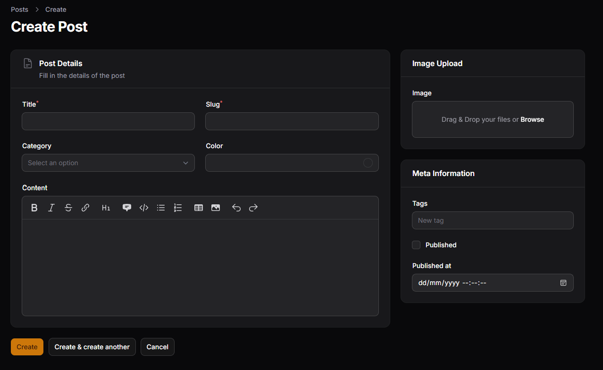
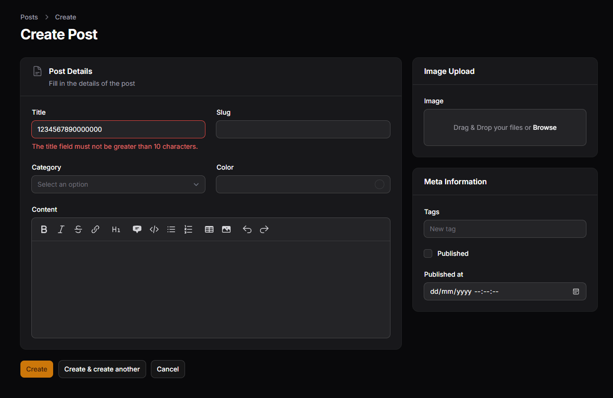
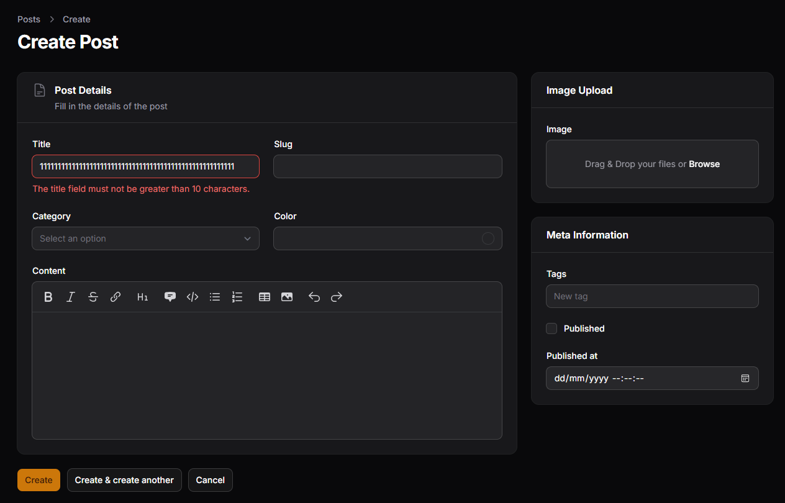
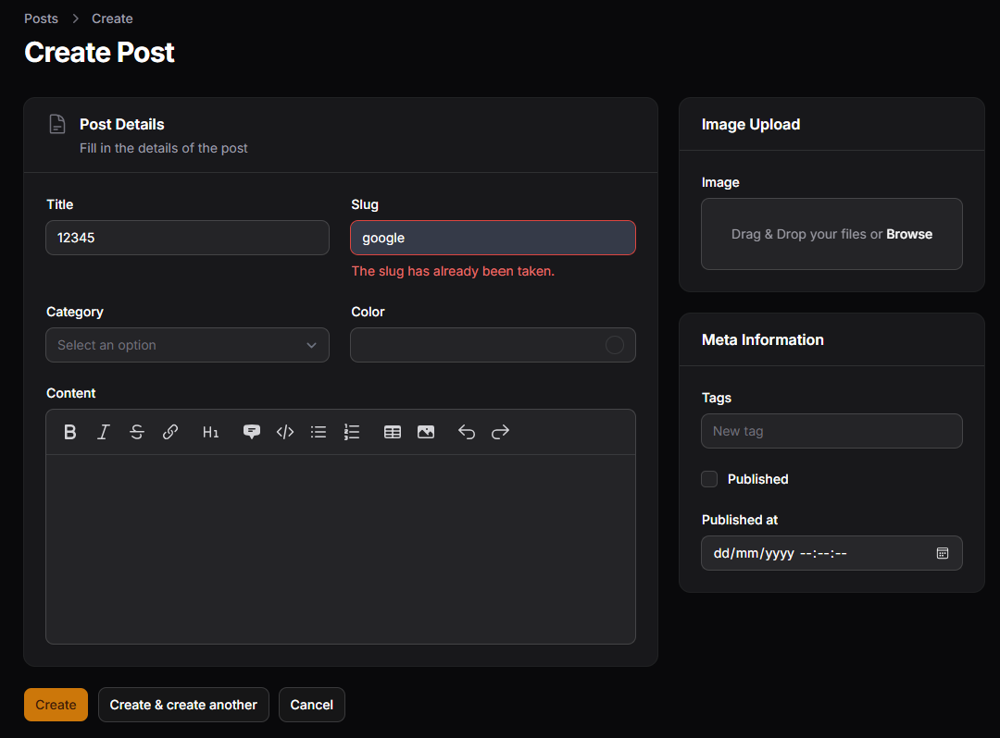
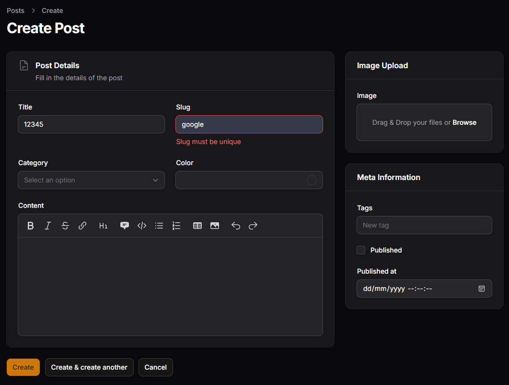
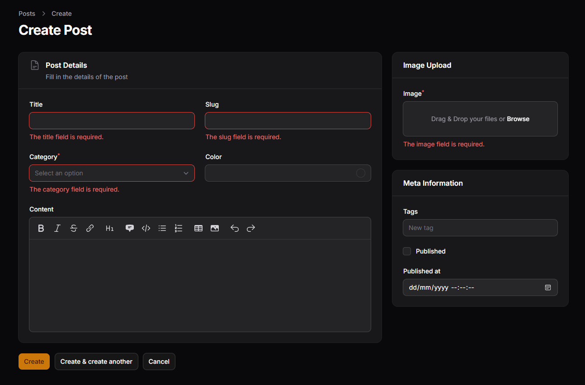

# Hasil Praktikum Jobsheet 03

## Method Required

## Method Rule

## Method Rules

## Unique Validation

## Custom Message

## Validasi Lengkap

## Analisis dan Diskusi
1. Mengapa validasi penting pada admin panel?
> Validasi sangat penting pada admin panel karena berfungsi untuk memastikan bahwa data yang dimasukkan sesuai dengan aturan yang telah ditentukan. Dengan adanya validasi, kesalahan input dapat dicegah sejak awal, sehingga menjaga kualitas dan konsistensi data dalam database serta menghindari potensi error pada sistem.

2. Apa perbedaan validasi client-side dan server-side?
> Perbedaan antara validasi client-side dan server-side terletak pada lokasi prosesnya. Validasi client-side dilakukan di sisi browser sebelum data dikirim ke server, sehingga memberikan respon yang cepat kepada pengguna, namun masih bisa dimanipulasi. Sedangkan validasi server-side dilakukan di server setelah data dikirim, sehingga lebih aman dan tidak dapat dilewati, meskipun membutuhkan waktu proses yang lebih lama.

3. Mengapa unique otomatis bekerja saat edit data?
> Validasi unique dapat otomatis bekerja saat proses edit data karena sistem secara default mengabaikan data yang sedang diedit. Artinya, jika nilai field tidak diubah, maka tidak akan dianggap sebagai duplikasi. Namun, jika nilai tersebut sama dengan data lain di database, maka validasi akan tetap menampilkan error.

4. Kapan kita perlu menggunakan `rules` array dibanding string?
> Penggunaan `rules` dalam bentuk array dibandingkan string biasanya diperlukan ketika aturan validasi yang digunakan cukup banyak atau kompleks. Format string lebih sederhana dan cocok untuk aturan yang sedikit, sedangkan format array lebih rapi, mudah dibaca, dan memudahkan penambahan atau pengelolaan aturan validasi yang lebih kompleks di dalam aplikasi.