# Hasil Praktikum Jobsheet 01

## Struktur Database Product
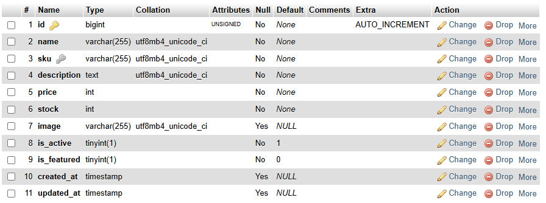
## Membuat Resource Product
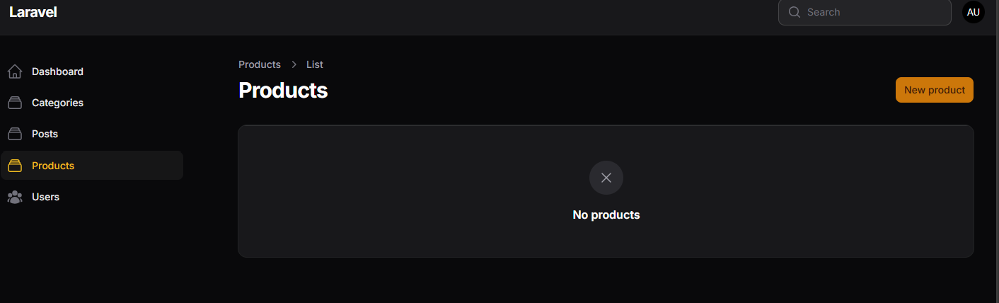
## Implementasi Wizard Form
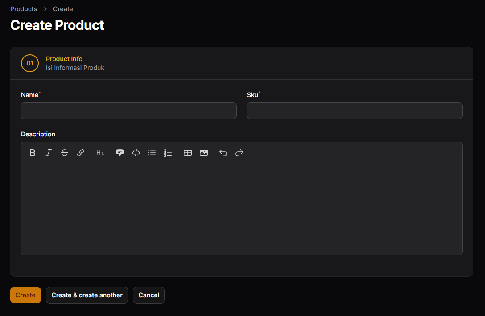
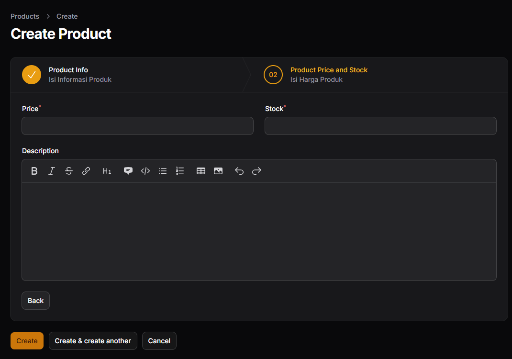
## Menambahkan Tombol Submit
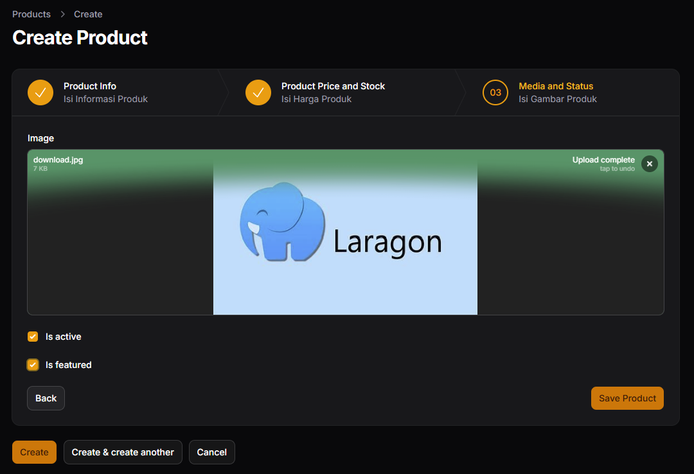
## Menghilangkan Default Button
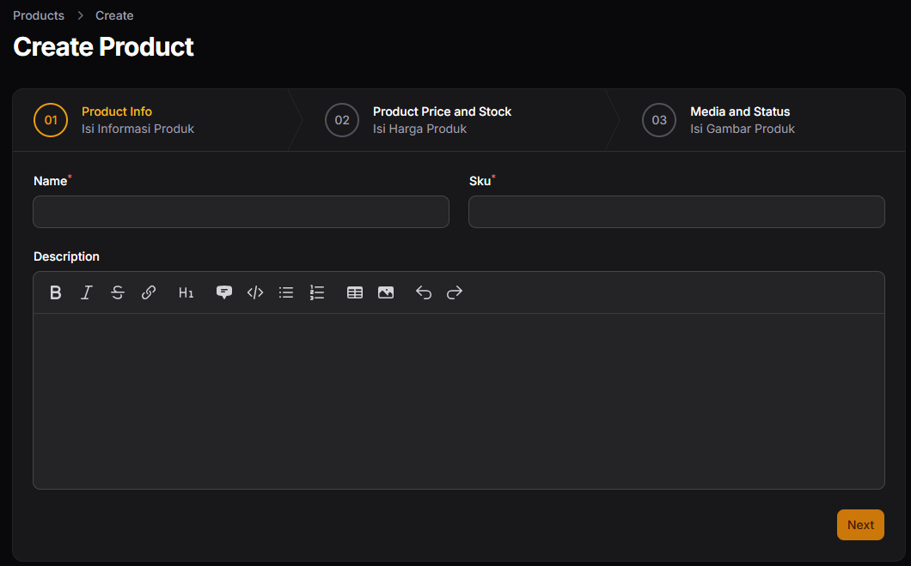
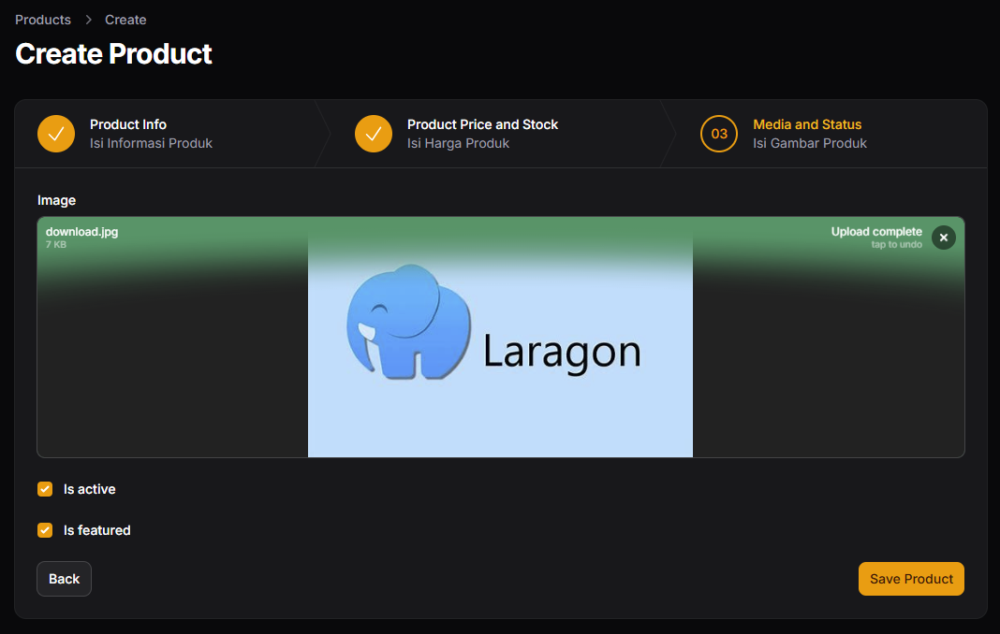
## Menambahkan Validasi per Step
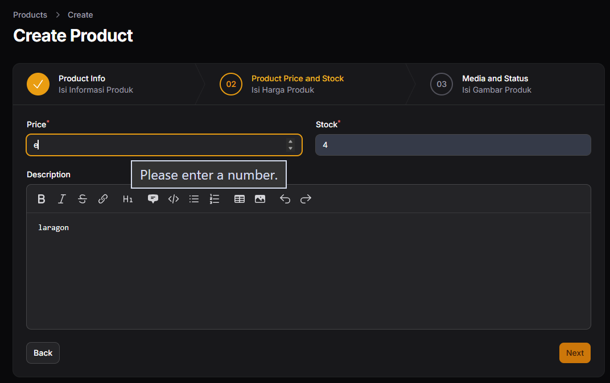
## Menampilkan Data pada Table
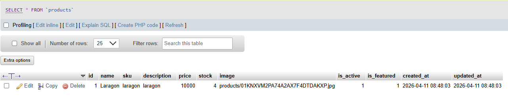

## Pengujian
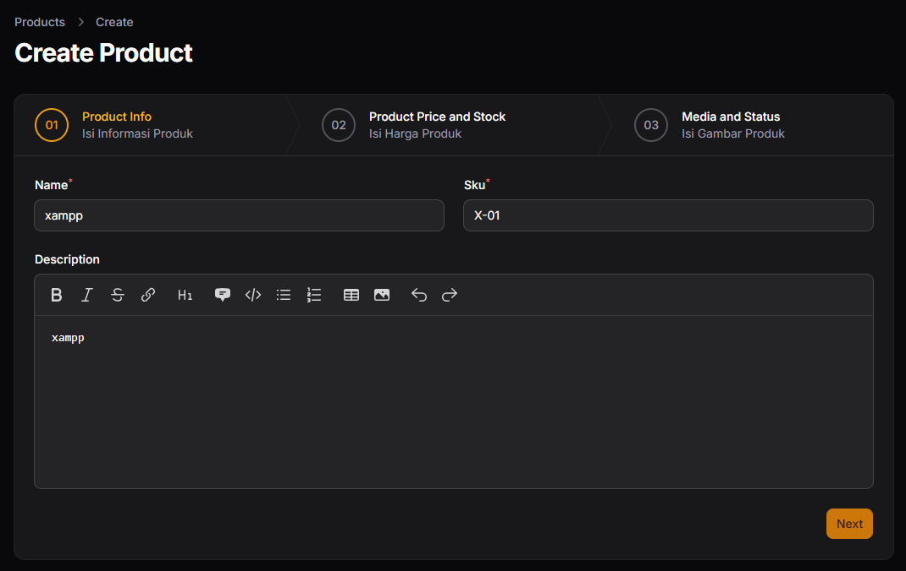
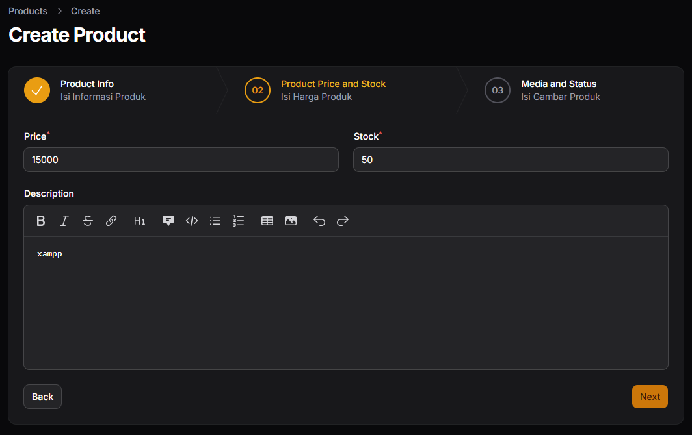
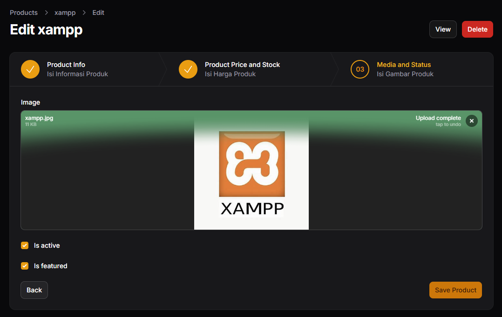
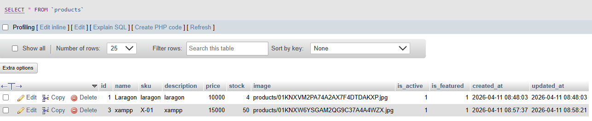

## Analisis dan Diskusi

1. Mengapa Wizard Form lebih baik untuk form panjang?
> Wizard Form lebih baik digunakan untuk form yang panjang karena mampu membagi proses input menjadi beberapa langkah yang lebih kecil dan terstruktur. Hal ini membuat pengguna tidak merasa kewalahan saat mengisi banyak data sekaligus, karena setiap langkah hanya berfokus pada satu bagian tertentu. Selain itu, wizard juga membantu meningkatkan pengalaman pengguna dengan memberikan alur yang jelas dan sistematis, sehingga kemungkinan kesalahan input dapat dikurangi.

2. Kapan kita menggunakan skippable()?
> Penggunaan skippable() diperlukan ketika ada langkah dalam wizard yang bersifat opsional dan tidak wajib diisi oleh pengguna. Dengan fitur ini, pengguna dapat melewati step tertentu tanpa harus mengisi semua field yang ada di dalamnya. Hal ini sangat berguna jika tidak semua data relevan untuk setiap pengguna, sehingga proses pengisian menjadi lebih fleksibel.

3. Apa kelebihan multi step dibanding single form panjang?
> Kelebihan multi step dibandingkan single form panjang terletak pada kemudahan penggunaan dan tingkat fokus pengguna. Multi step memungkinkan pengguna untuk mengisi data secara bertahap, sehingga lebih terorganisir dan tidak membingungkan. Selain itu, validasi juga dapat dilakukan per langkah, sehingga kesalahan dapat langsung diperbaiki tanpa harus menunggu seluruh form selesai diisi. Hal ini membuat proses input menjadi lebih efisien dan user-friendly.

4. Apakah wizard cocok untuk semua jenis form?
> Wizard tidak selalu cocok untuk semua jenis form. Untuk form yang sederhana dan memiliki sedikit field, penggunaan wizard justru dapat memperlambat proses karena menambah jumlah langkah yang harus dilalui. Wizard lebih cocok digunakan untuk form yang kompleks dan memiliki banyak data, seperti pendaftaran, checkout, atau pengisian data lengkap, di mana pembagian langkah akan sangat membantu pengguna dalam menyelesaikan proses dengan lebih nyaman.

## Tugas Praktikum
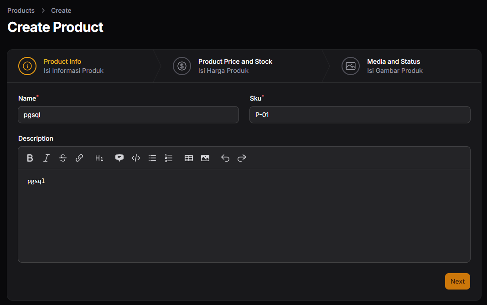
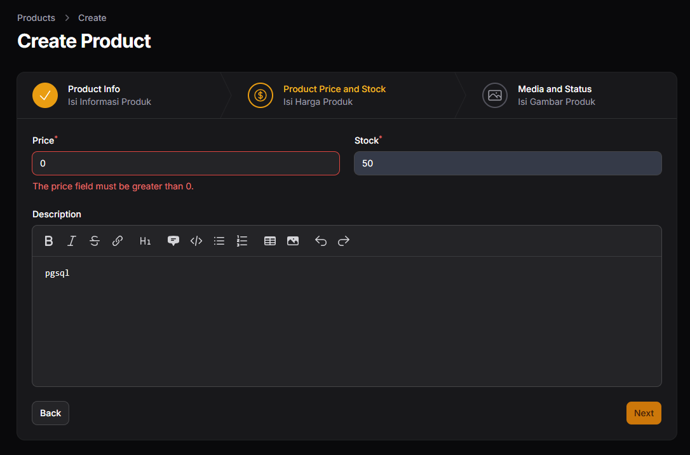
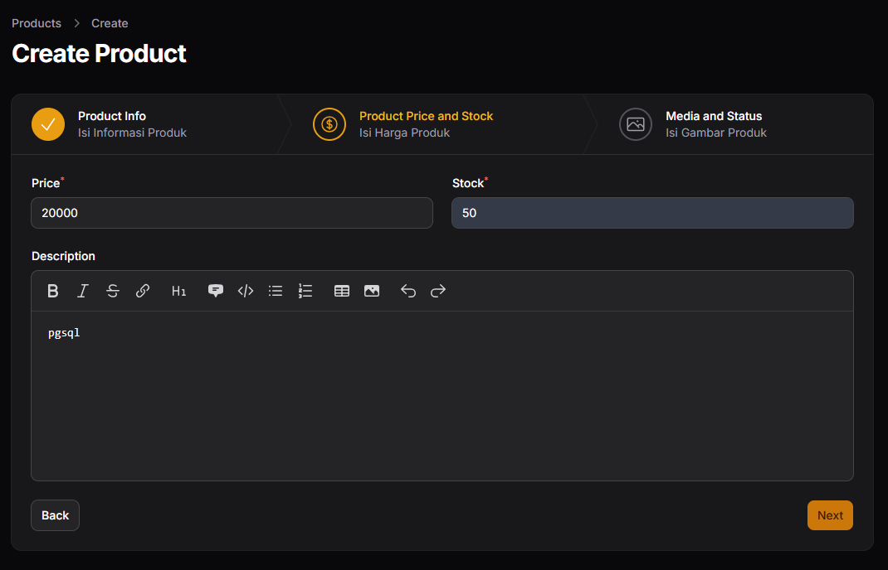
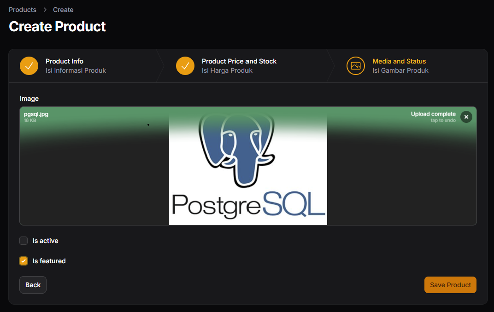

