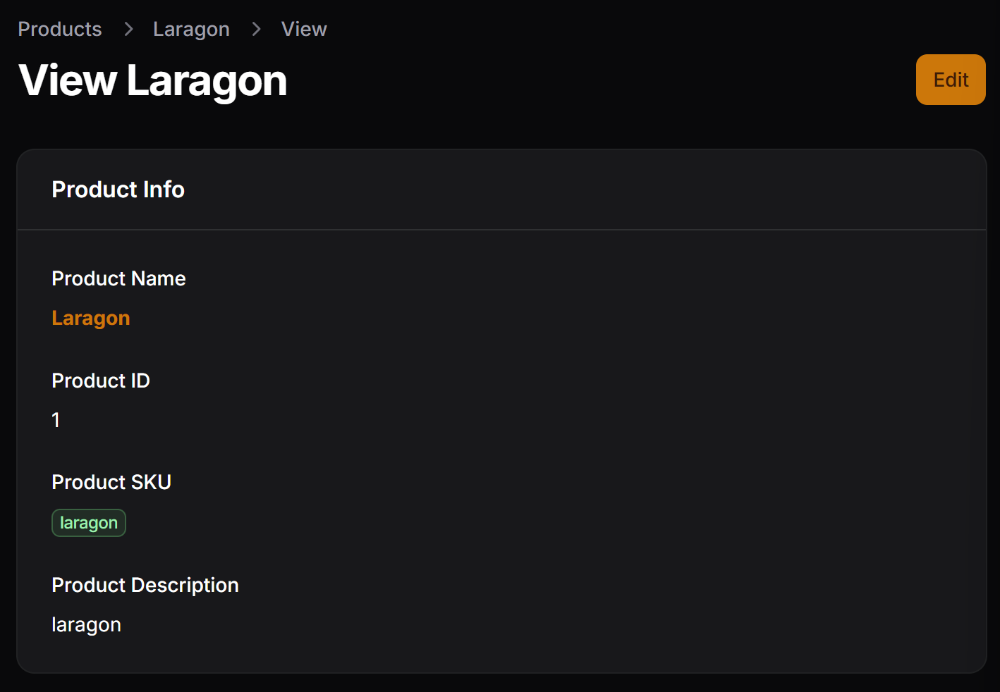
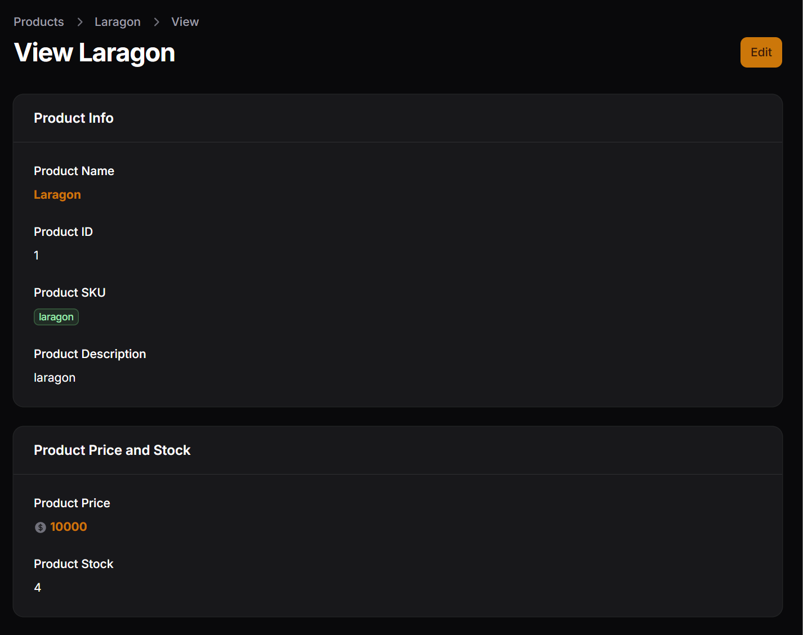
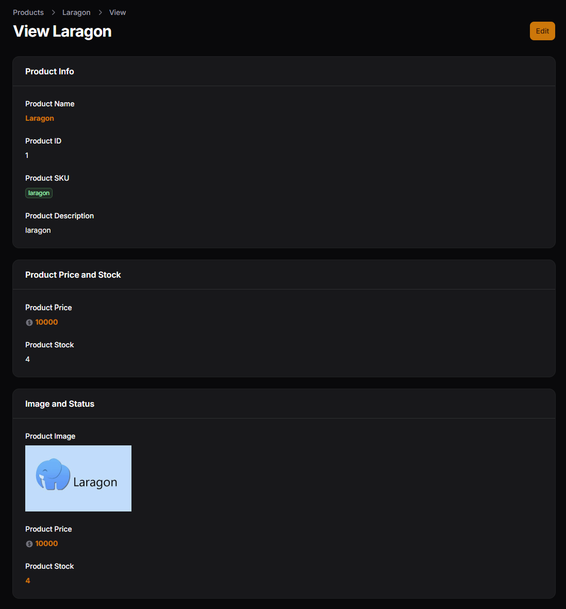
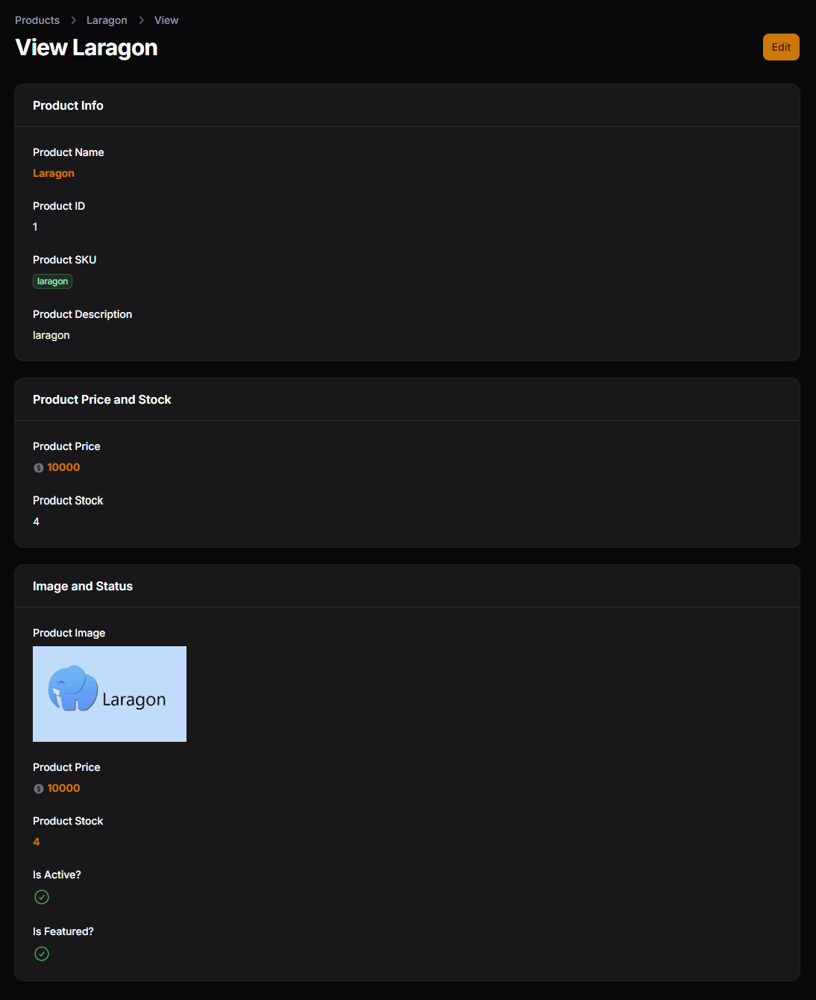
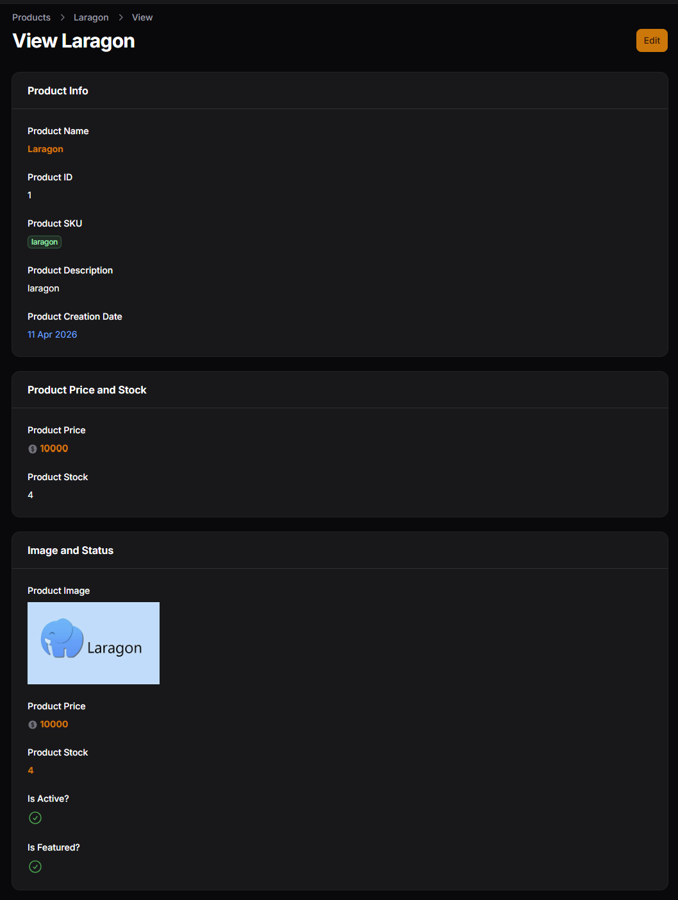
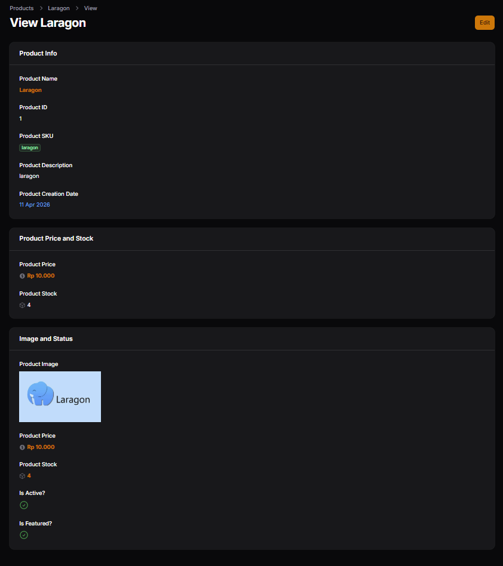
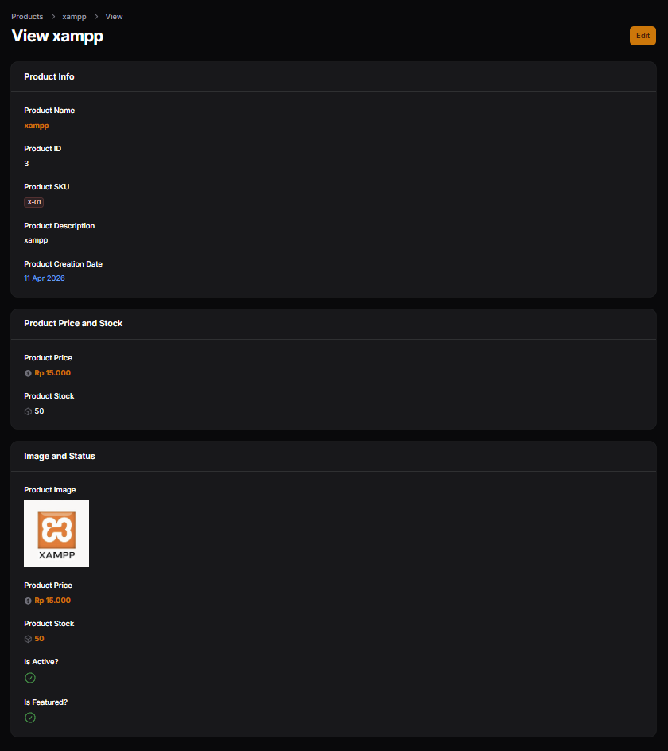

# Hasil Praktikum Jobsheet 02

## Membuat Section – Product Info

## Section – Pricing & Stock

## Section – Media & Status

## Menampilkan Status Boolean

## Menampilkan Tanggal dengan Format

## Latihan Praktikum

## Analisis dan Diskusi

1. Mengapa View Page tidak cocok menggunakan form input?
> View Page tidak cocok menggunakan form input karena tujuan utamanya adalah untuk menampilkan data, bukan untuk mengubahnya. Jika menggunakan form input, pengguna bisa saja mengira bahwa data tersebut dapat diedit, padahal halaman view seharusnya hanya bersifat read-only. Oleh karena itu, komponen yang digunakan pada View Page biasanya berupa elemen display agar informasi dapat ditampilkan dengan jelas tanpa memberikan interaksi edit.
2. Apa perbedaan TextColumn dan TextEntry?
> Perbedaan antara TextColumn dan TextEntry terletak pada konteks penggunaannya. TextColumn digunakan pada tabel untuk menampilkan data dalam bentuk kolom, biasanya dalam daftar banyak data (list view). Sedangkan TextEntry digunakan pada halaman detail (view page) untuk menampilkan satu data secara lebih terfokus. Jadi, TextColumn lebih cocok untuk tampilan banyak data sekaligus, sementara TextEntry digunakan untuk menampilkan detail satu record.
3. Kapan kita menggunakan badge?
> Badge digunakan ketika kita ingin menampilkan data dengan penekanan visual tertentu, biasanya untuk status atau kategori seperti “published”, “draft”, atau “active”. Dengan badge, informasi menjadi lebih mudah dikenali karena memiliki warna atau label khusus, sehingga pengguna dapat memahami status data dengan cepat tanpa harus membaca teks panjang.
4. Apa keuntungan menggunakan IconEntry untuk boolean?
> Penggunaan IconEntry untuk boolean memiliki keuntungan dalam hal visualisasi yang lebih cepat dan intuitif. Daripada menampilkan teks seperti “true” atau “false”, IconEntry biasanya menampilkan ikon seperti centang atau silang, sehingga pengguna bisa langsung memahami kondisi data hanya dengan melihat simbolnya. Hal ini membuat tampilan lebih bersih, ringkas, dan mudah dipahami.

