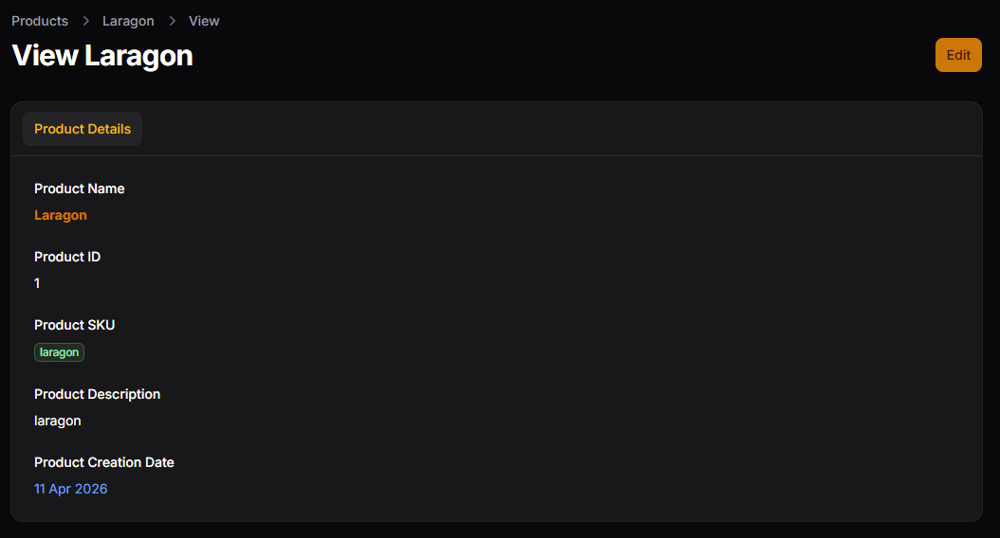
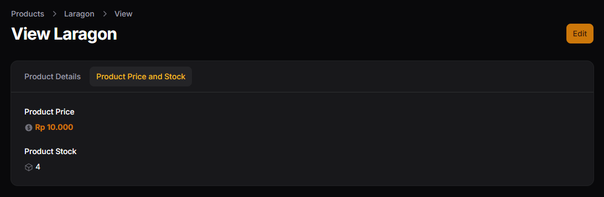
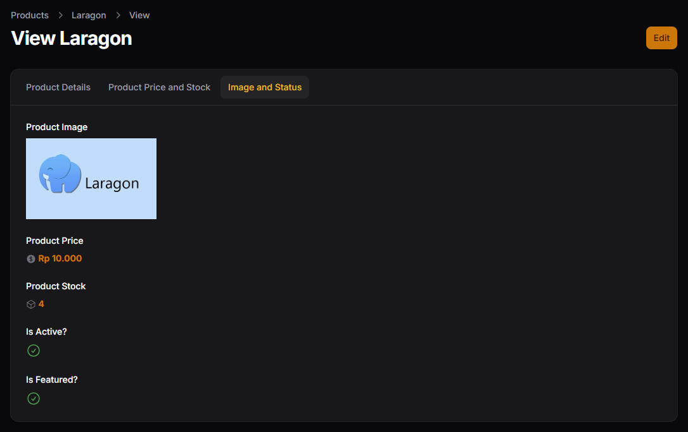
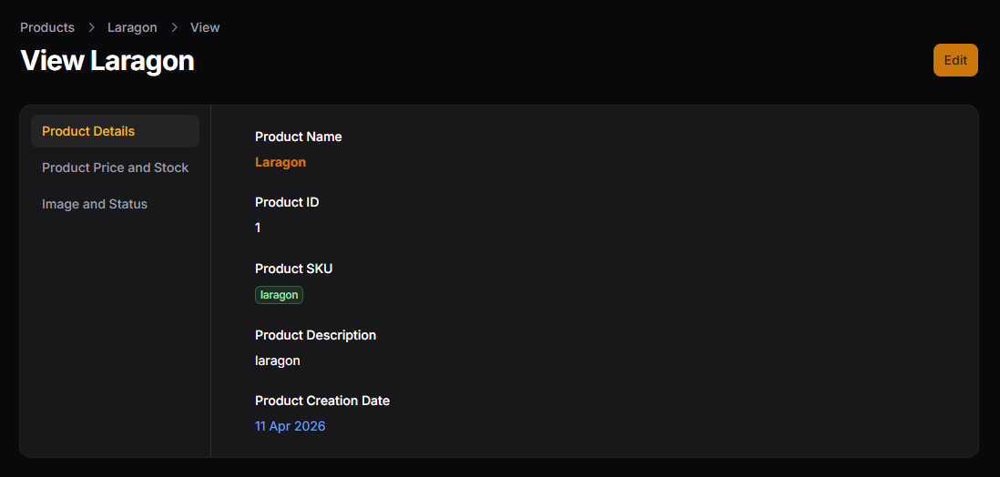
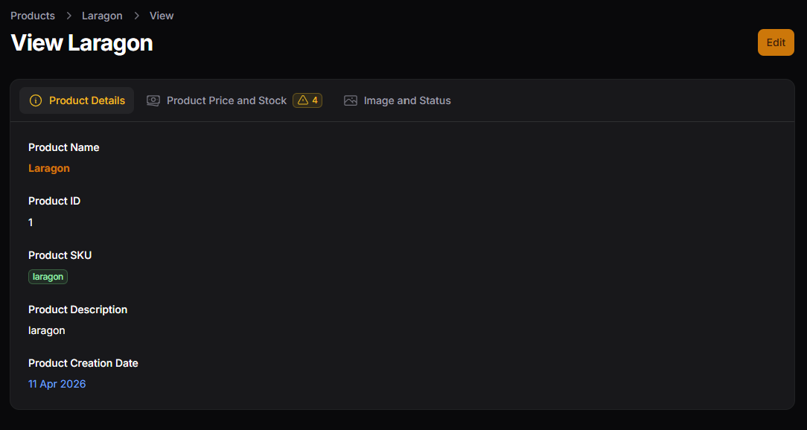
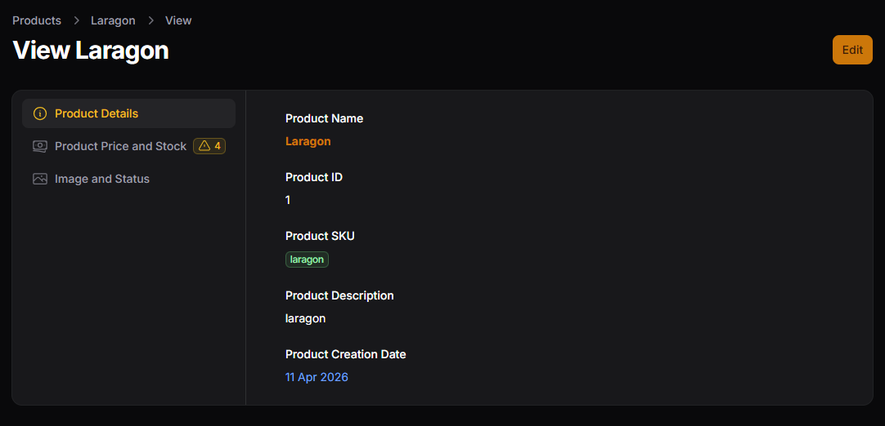

# Hasil Praktikum Jobsheet 03

## Mengubah Section Menjadi Tabs

## Mengubah Tabs Menjadi Vertical

## Latihan Praktikum

## Analisis dan Diskusi

1. Kapan kita menggunakan Tabs dibanding Section?
>Penggunaan Tabs dibanding Section biasanya dilakukan ketika data yang ditampilkan atau diinput sudah cukup banyak dan memiliki beberapa kategori yang berbeda. Tabs lebih cocok digunakan jika ingin memisahkan konten ke dalam beberapa halaman kecil dalam satu tampilan, sehingga pengguna dapat berpindah antar bagian tanpa harus scroll panjang. Sementara itu, Section lebih cocok untuk pengelompokan dalam satu halaman yang masih bisa dilihat secara bersamaan.
2. Apa kelebihan Tabs untuk data panjang?
> Kelebihan Tabs untuk data panjang adalah kemampuannya dalam mengurangi kepadatan tampilan dan meningkatkan fokus pengguna. Dengan Tabs, informasi dibagi ke dalam beberapa bagian yang terpisah, sehingga tampilan menjadi lebih bersih dan tidak terlalu penuh. Hal ini membuat pengguna lebih mudah memahami isi data karena hanya melihat satu bagian dalam satu waktu, tanpa terganggu oleh informasi lain yang tidak relevan saat itu.
3. Apakah Tabs bisa digunakan pada Form juga?
> Tabs juga bisa digunakan pada Form, tidak hanya pada halaman tampilan data. Dalam Form, Tabs sangat berguna untuk memisahkan input berdasarkan kategori tertentu, seperti data utama, metadata, dan pengaturan lainnya. Ini membantu pengguna dalam mengisi form yang kompleks agar tetap terorganisir dan tidak membingungkan.
4. Bagaimana jika tab terlalu banyak?
> Jika jumlah tab terlalu banyak, hal tersebut justru dapat membingungkan pengguna dan menurunkan kenyamanan penggunaan. Dalam kondisi seperti ini, sebaiknya dilakukan pengelompokan ulang dengan menggabungkan beberapa tab yang serupa atau menggunakan pendekatan lain seperti Section atau Wizard. Tujuannya adalah agar navigasi tetap sederhana dan pengguna tidak kesulitan dalam menemukan informasi yang dibutuhkan.

