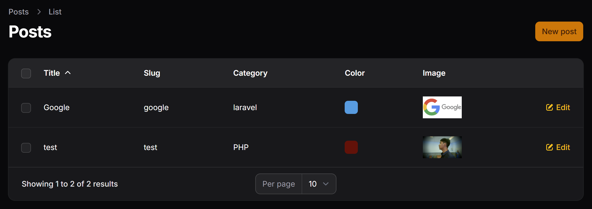
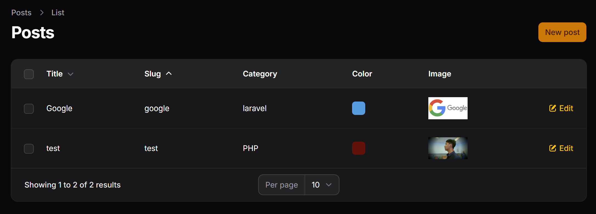
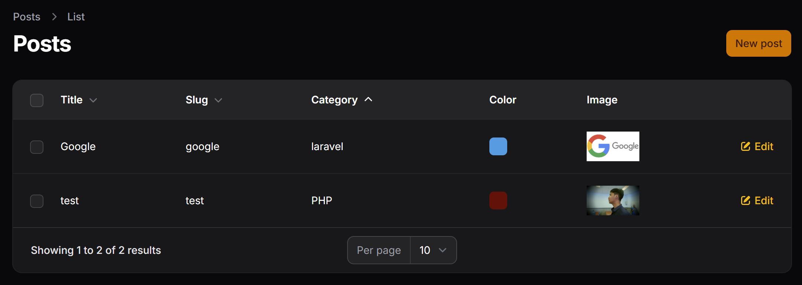
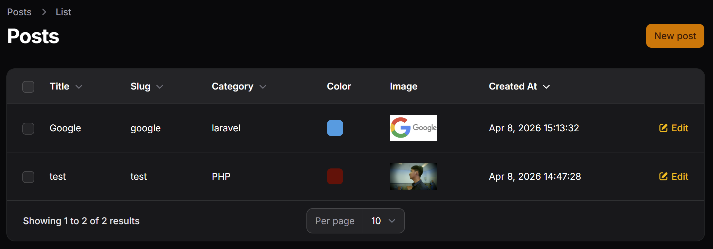
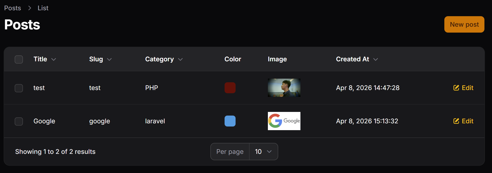
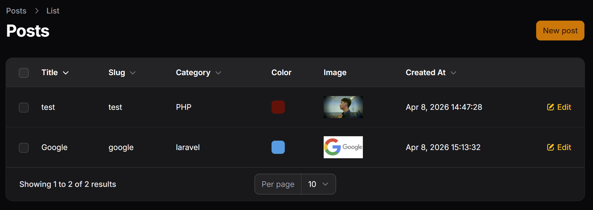

# Hasil Praktikum Jobsheet 01

## Sorting pada Kolom Title

## Sorting pada Kolom Slug

## Sorting pada Relasi (Category)

## Sorting pada Kolom Tanggal

## Mengatur Default Sorting


## Latihan Praktikum
1. Aktifkan sorting pada semua kolom teks
> Menambahkan `sortable` ke semua kolom teks seperti
```php
TextColumn::make("title")
    ->sortable()
```
2. Buat default sorting berdasarkan Created At descending
```php
return $table
            ->columns([
                ...
            ])->defaultSort("created_at", "desc")
```

3. Uji sorting ascending dan descending
### Sorting Title Asc

### Sorting Title Desc

### Sorting Date Desc


## Analisis dan Diskusi

1. Mengapa sorting penting pada admin panel?
> Sorting penting pada admin panel karena membantu pengguna dalam mengelola dan menemukan data dengan lebih cepat dan efisien. Dengan adanya fitur sorting, data dapat diurutkan berdasarkan kolom tertentu seperti tanggal, nama, atau status, sehingga memudahkan pencarian informasi tanpa harus melihat seluruh data secara manual.

2. Apa perbedaan sortable biasa dengan `defaultSort()`?
> Perbedaan antara sortable biasa dengan `defaultSort()` terletak pada fungsinya. Sortable biasa memungkinkan pengguna untuk mengklik kolom tertentu di tabel untuk mengurutkan data secara manual sesuai kebutuhan. Sedangkan `defaultSort()` digunakan untuk menentukan urutan data secara otomatis saat halaman pertama kali dibuka, tanpa perlu interaksi dari pengguna.

3. Mengapa relasi tetap bisa di-sort?
> Relasi tetap bisa di-sort karena data relasi dapat diakses melalui query database yang melakukan join antar tabel. Dengan demikian, kolom dari tabel yang berelasi, seperti `category.name`, tetap bisa digunakan sebagai acuan pengurutan karena database mampu mengolahnya sebagai bagian dari query utama.

4. Kapan kita menggunakan `desc` sebagai default?
> Penggunaan `desc` sebagai default biasanya dilakukan ketika ingin menampilkan data terbaru atau paling relevan terlebih dahulu, seperti pada kolom tanggal pembuatan atau update. Dengan urutan menurun (descending), data yang paling baru akan muncul di bagian atas, sehingga lebih mudah diakses oleh pengguna tanpa perlu melakukan sorting ulang.


