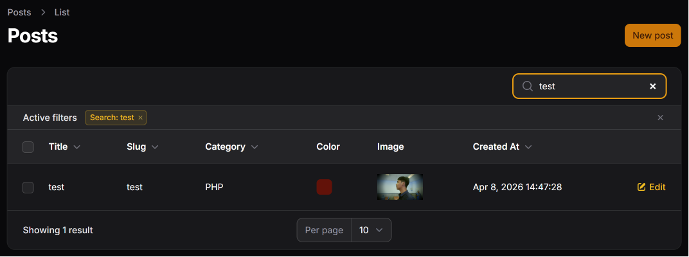
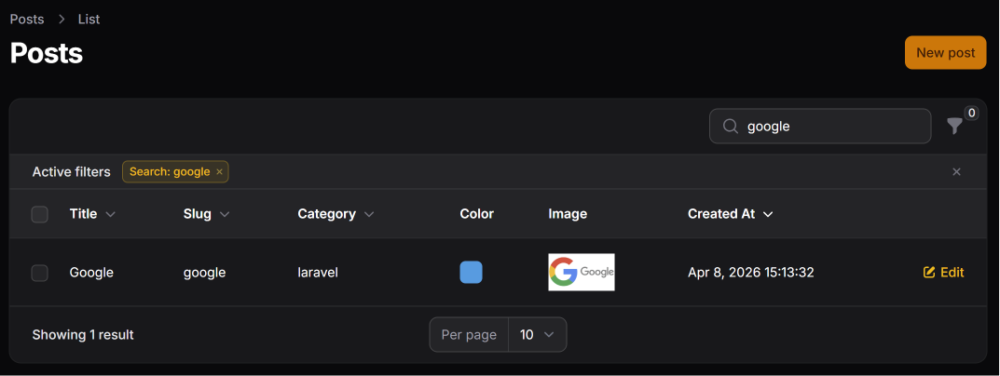
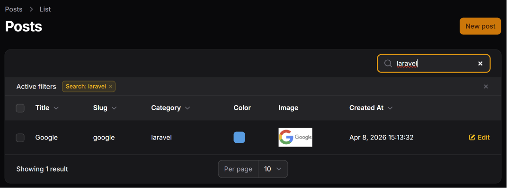
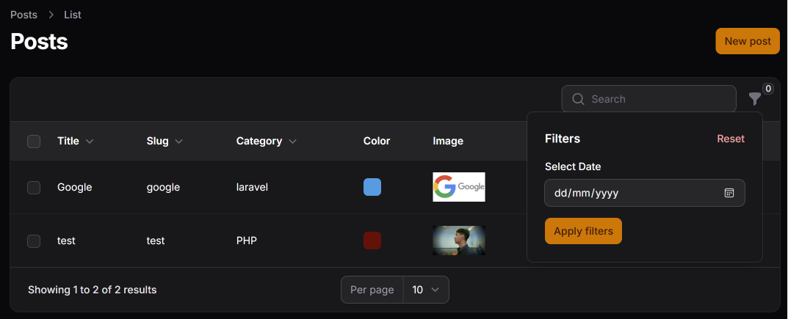
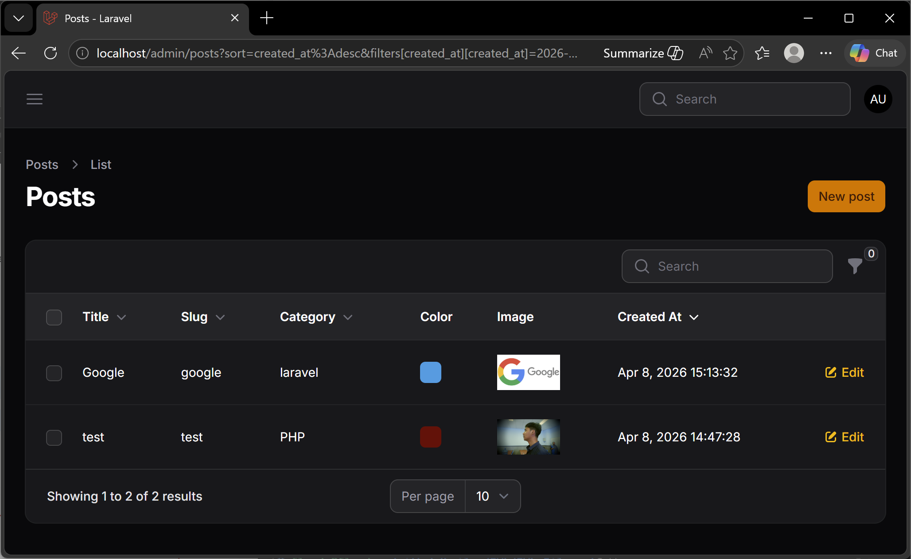
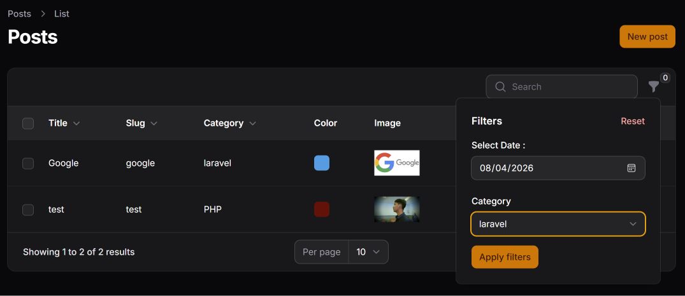
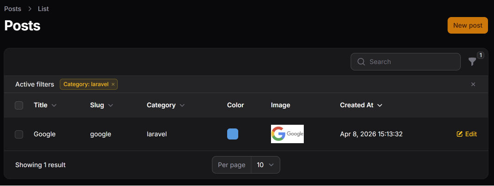
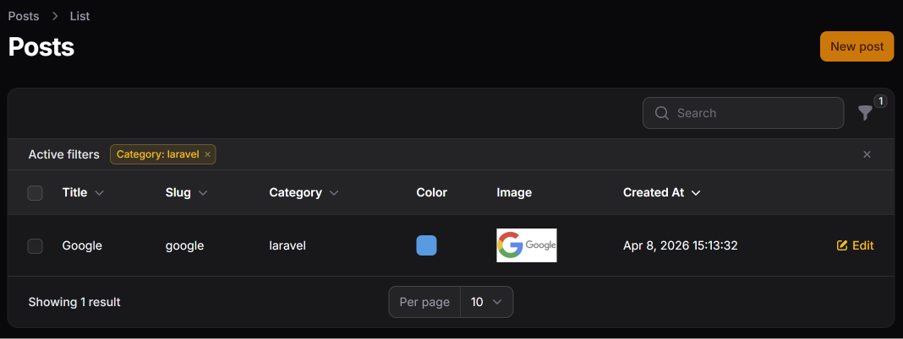

# Hasil Praktikum Jobsheet 11

## Search pada Kolom Title

## Search pada Kolom Slug

## Search pada Relasi (Category)

## Filter Berdasarkan Tanggal

## Menambah Query Logic

## Filter Berdasarkan Relasi (Kategori)



## Latihan Praktikum
1. Aktifkan search pada minimal 3 kolom
> Tambahkan `searchable` ke semua kolom teks seperti
```php
TextColumn::make("title")
    ->searchable()
```
2. Buat filter tanggal Created At
```php
Filter::make("created_at")
    ->label("Creation Date")
        ->schema([
            DatePicker::make("created_at")
                ->label("Select Date : "),
        ])
        ->query(function ($query, $data) {
            return $query
                ->when(
                    $data["created_at"],
                    fn ($query, $date) => $query->whereDate("created_at", $date),
                );
        }),
```

3. Buat filter kategori menggunakan SelectFilter
```php
SelectFilter::make("category_id")
    ->relationship("category", "name")
    ->label("Category")
    ->preload(), 
```
4. Uji kombinasi Search + Filter



5. Screenshot:
### Search Title

### Filter Tanggal


### Filter Kategori


## Analisis dan Diskusi

1. Mengapa search tidak cocok untuk filter tanggal?
> Search tidak cocok digunakan untuk filter tanggal karena fitur search umumnya dirancang untuk mencari teks atau kata kunci tertentu, bukan untuk melakukan pencarian berdasarkan rentang atau format tanggal yang spesifik. Data tanggal biasanya memerlukan logika perbandingan seperti sebelum, sesudah, atau pada tanggal tertentu, sehingga lebih tepat menggunakan filter khusus agar hasil pencarian lebih akurat dan mudah digunakan.

2. Apa fungsi `relationship()` pada SelectFilter?
> Fungsi `relationship()` pada SelectFilter adalah untuk mengambil data dari relasi model sehingga pilihan filter dapat ditampilkan berdasarkan data yang berasal dari tabel lain. Misalnya, pada relasi kategori, `relationship()` memungkinkan filter menampilkan nama kategori secara otomatis tanpa harus menulis query manual, sehingga mempermudah pengelolaan filter berbasis relasi.

3. Mengapa kita perlu `whereDate()` pada query filter?
> Penggunaan `whereDate()` pada query filter diperlukan agar proses pencarian hanya membandingkan bagian tanggal saja tanpa memperhitungkan jam, menit, atau detik. Hal ini penting karena field datetime di database biasanya menyimpan waktu lengkap. Dengan `whereDate()`, filter menjadi lebih akurat ketika pengguna ingin mencari data berdasarkan tanggal tertentu.

4. Apa perbedaan `searchable()` dan `filters()`?
> Perbedaan antara `searchable()` dan `filters()` terletak pada tujuan penggunaannya. `searchable()` digunakan untuk mencari data berdasarkan kata kunci pada kolom tertentu secara cepat dan fleksibel. Sedangkan `filters()` digunakan untuk menyaring data berdasarkan kondisi atau kategori tertentu, seperti status, tanggal, atau relasi. Search lebih fokus pada pencarian teks, sementara filter lebih fokus pada pengelompokan dan penyaringan data berdasarkan aturan tertentu.