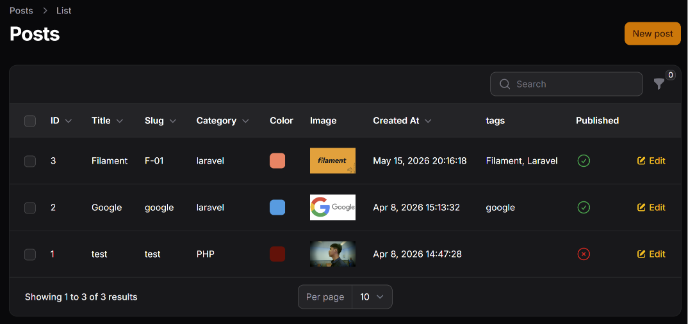
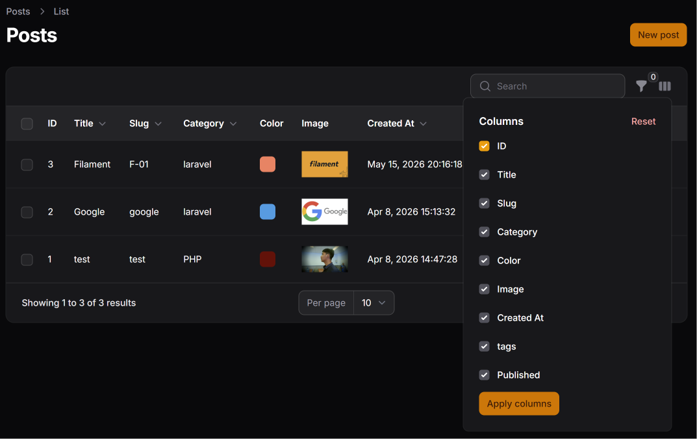
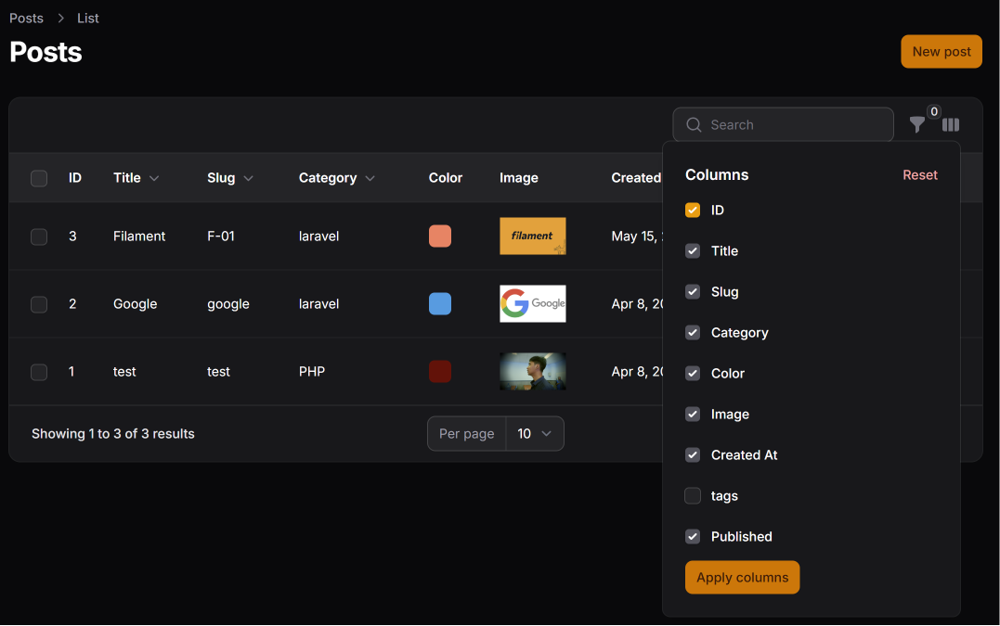
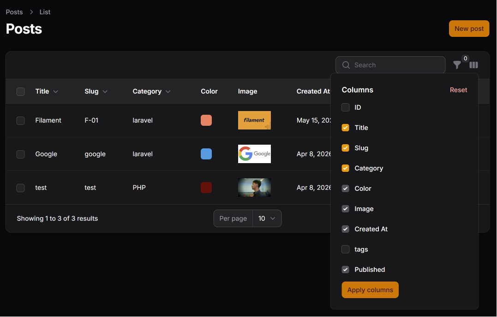
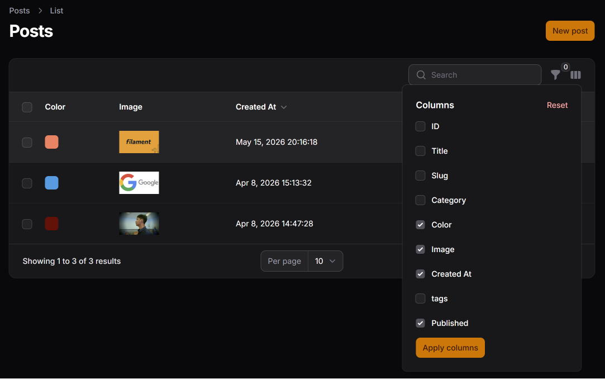
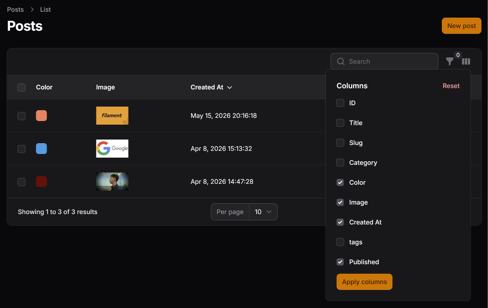
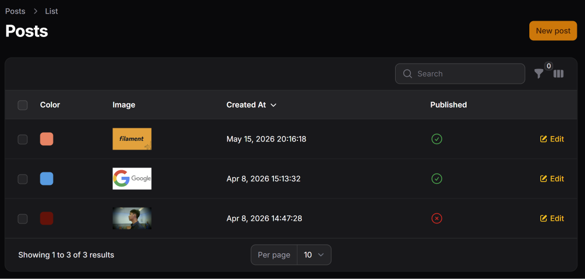

# Hasil Praktikum Jobsheet 12

## Menambahkan Kolom Baru

## Mengaktifkan Toggle Column

## Menyembunyikan Kolom Secara Default

## Menerapkan Toggle pada Semua Kolom



## Latihan Praktikum
1. Aktifkan search pada minimal 3 kolom
> Tambahkan `searchable` ke semua kolom teks seperti
```php
TextColumn::make("title")
    ->sortable()
    ->toggleable()
    ->searchable(),
```
2. Sembunyikan minimal 2 kolom secara default
```php
return $table
    ->columns([
        TextColumn::make("id")
            ->label("ID")
            ->toggleable(isToggledHiddenByDefault: true),
        TextColumn::make("tags")
            ->label("tags")
            ->toggleable(isToggledHiddenByDefault: true),
    ])
```

3. Uji apakah preferensi tetap tersimpan saat pindah halaman
#### Sebelum:

#### Sesudah:


4. Screenshot:
### Tampilan sebelum toggle

### Menu toggle kolom

### Tampilan setelah beberapa kolom disembunyikan



## Analisis dan Diskusi

1. Mengapa toggle column penting pada admin panel?
> Toggle column penting pada admin panel karena memberikan fleksibilitas kepada pengguna untuk menentukan kolom mana yang ingin ditampilkan atau disembunyikan pada tabel. Dengan fitur ini, tampilan tabel menjadi lebih rapi dan pengguna dapat fokus pada informasi yang benar-benar dibutuhkan tanpa terganggu oleh terlalu banyak kolom.
2. Apa perbedaan `toggleable()` biasa dengan `isToggledHiddenByDefault`?
> Perbedaan antara `toggleable()` biasa dengan `isToggledHiddenByDefault` terletak pada kondisi awal tampilan kolom. `toggleable()` hanya membuat kolom dapat disembunyikan atau ditampilkan oleh pengguna, tetapi secara default kolom tersebut tetap terlihat. Sedangkan `isToggledHiddenByDefault` membuat kolom langsung tersembunyi saat halaman pertama kali dibuka, namun pengguna masih dapat menampilkannya kembali jika diperlukan.
3. Mengapa preferensi kolom tetap tersimpan?
> Preferensi kolom dapat tetap tersimpan karena Filament otomatis menyimpan pengaturan pengguna di session. Dengan begitu, ketika pengguna membuka kembali halaman admin, tampilan kolom akan tetap sesuai dengan pengaturan terakhir yang dipilih, sehingga pengalaman penggunaan menjadi lebih nyaman dan konsisten.
4. Kapan sebaiknya kolom disembunyikan secara default?
> Kolom sebaiknya disembunyikan secara default ketika informasi tersebut jarang digunakan, terlalu detail, atau hanya dibutuhkan dalam kondisi tertentu. Contohnya seperti ID, timestamp, atau data teknis lainnya. Dengan menyembunyikan kolom yang kurang penting, tampilan tabel menjadi lebih sederhana dan mudah dibaca oleh pengguna.