# Hasil Praktikum Jobsheet 13

## Menambahkan Delete Action
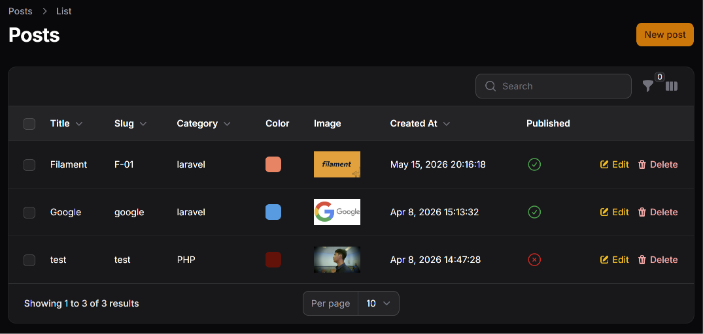
## Menambahkan Replicate Action
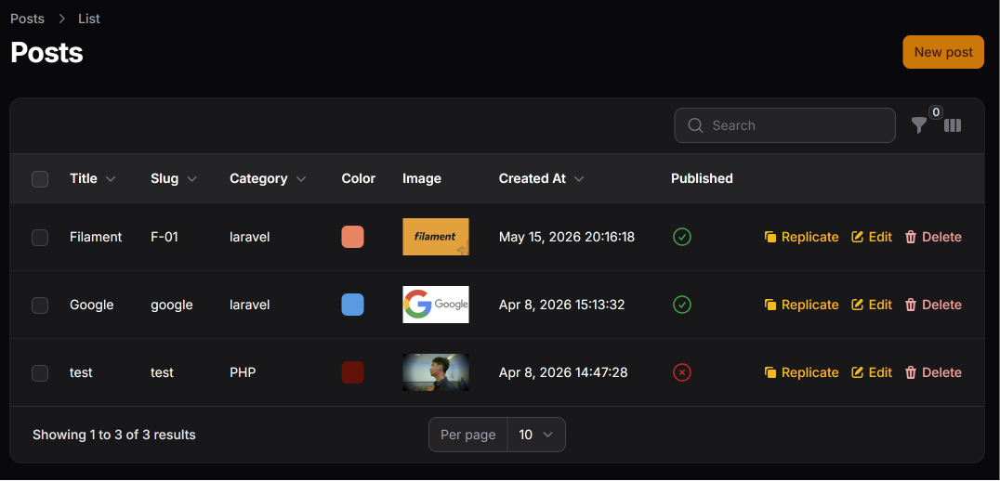
## Membuat Custom Action (Ubah Status Publish)
### 1. Menambahkan Custom Action
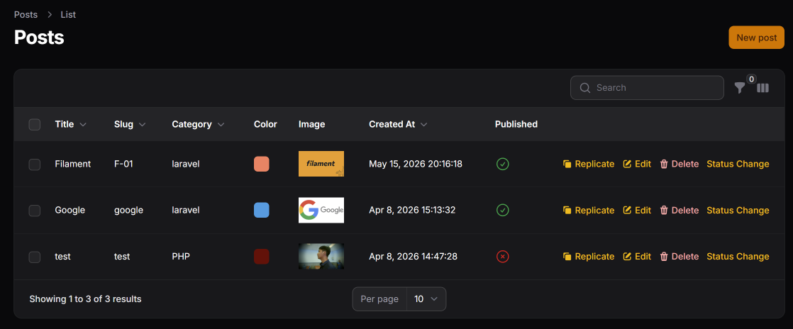
### 2. Menambahkan Form Input
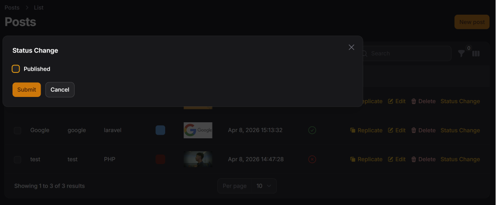
### 3. Menambahkan Icon dan Logic untuk Update Data
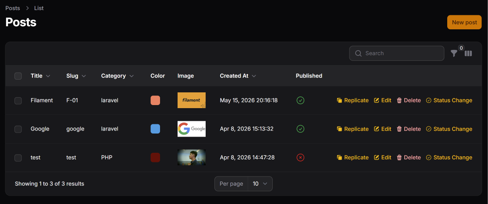
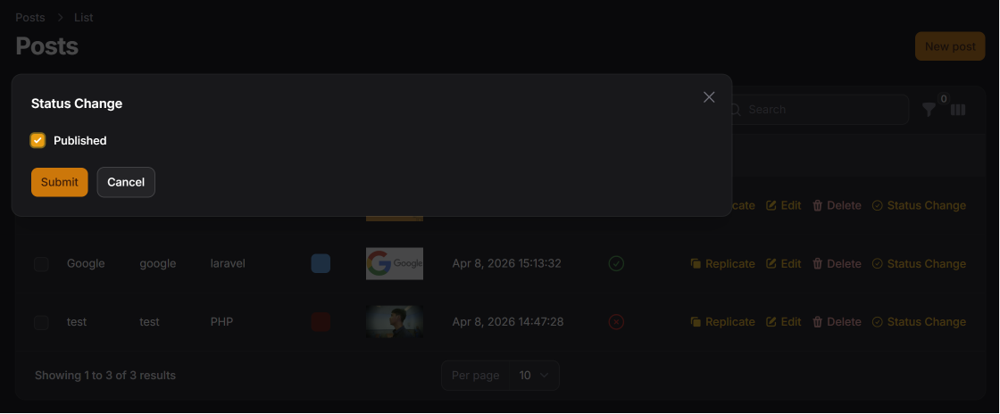
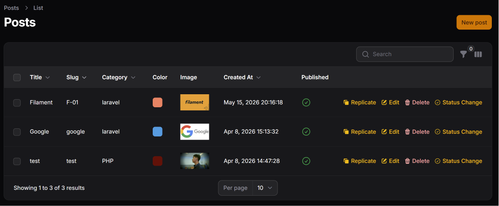


## Latihan Praktikum
1. Tambahkan Delete & Replicate action
> Tambahkan `ReplicateAction` dan `DeleteAction` dan di bagian recordActions seperti
```php
->recordActions([
    ReplicateAction::make(),
    DeleteAction::make(),
])
```
2. Buat custom action untuk toggle publish/unpublish
```php
->recordActions([
    Action::make("togglePublished")
        ->label(fn ($record): string => $record->published ? "Unpublish" : "Publish")
        ->icon(fn ($record): string => $record->published ? "heroicon-o-x-circle" : "heroicon-o-check-circle")
        ->requiresConfirmation()
        ->action(function ($record) {
            $record->update(["published" => ! $record->published]);
        })
])
```
### Hasil Toggleable
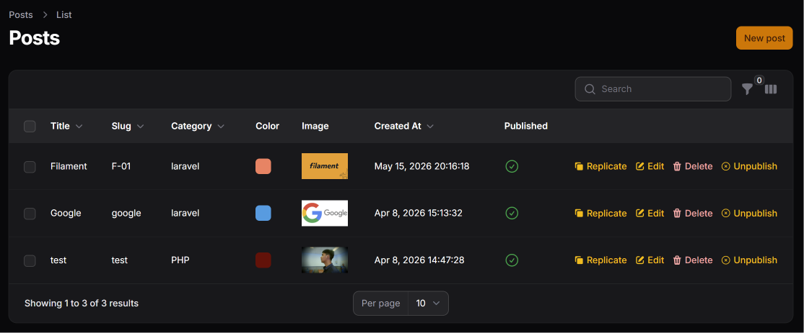
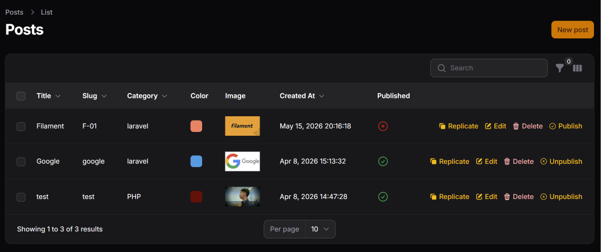

3. Tambahkan icon berbeda untuk tiap action
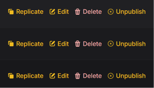

4. Tambahkan confirmation pada custom action
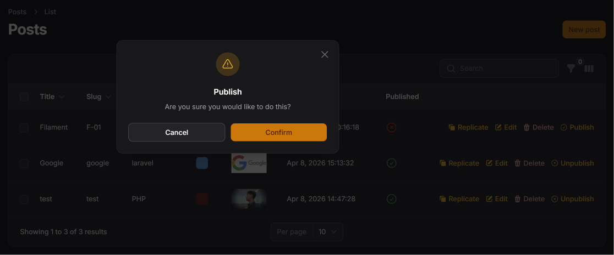

5. Screenshot:
### Delete button di tabel

### Replicate action

### Custom status action


## Analisis dan Diskusi
1. Mengapa action di tabel lebih efisien dibanding halaman edit?
> Action di tabel lebih efisien dibanding halaman edit karena pengguna dapat langsung melakukan suatu tindakan terhadap data tanpa harus berpindah halaman. Dengan action di tabel, pengguna dapat menghemat waktu karena semua proses dilakukan langsung dari daftar data.
2. Apa perbedaan predefined action dan custom action?
> Perbedaan antara predefined action dan custom action terletak pada tingkat fleksibilitasnya. Predefined action merupakan action bawaan dari Filament seperti Edit, Delete, atau View yang sudah disediakan dan siap digunakan. Sedangkan custom action adalah action yang dibuat sendiri oleh developer untuk kebutuhan tertentu, misalnya mengubah status, mengirim notifikasi, atau melakukan proses khusus lainnya yang tidak tersedia secara default.
3. Bagaimana cara menambahkan validasi dalam custom action?
> Cara menambahkan validasi dalam custom action adalah dengan mendefinisikan form pada action tersebut, lalu memberikan aturan validasi pada field yang digunakan, seperti required(), rules(), atau validasi Laravel lainnya. Dengan begitu, data yang dimasukkan pengguna tetap diperiksa sebelum action dijalankan sehingga mencegah input yang tidak valid.
4. Kapan kita menggunakan Replicate?
> Replicate digunakan ketika ingin membuat salinan data yang sudah ada tanpa harus menginput ulang seluruh informasi dari awal. Fitur ini sangat berguna jika terdapat data dengan struktur yang hampir sama, misalnya membuat post baru berdasarkan post sebelumnya atau menggandakan produk dengan detail yang mirip.